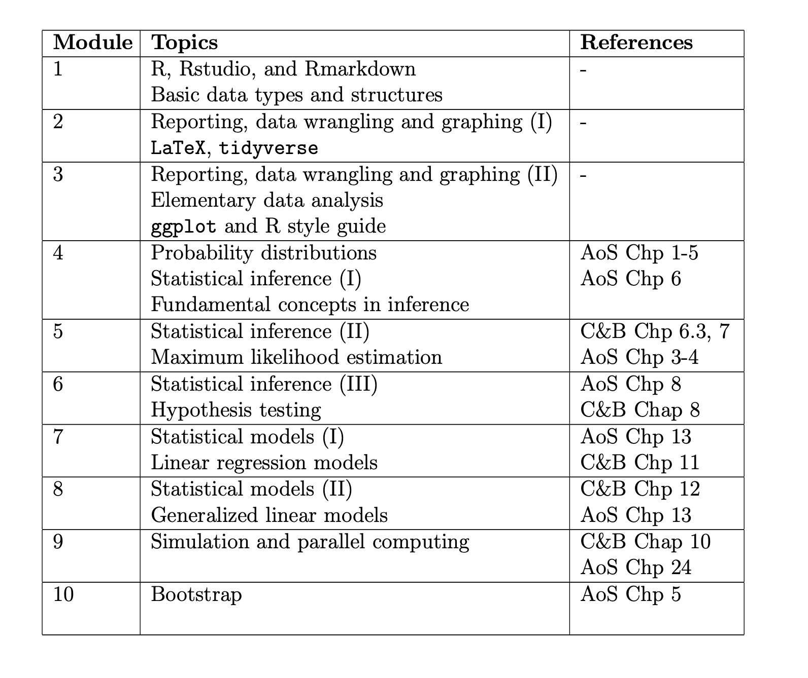
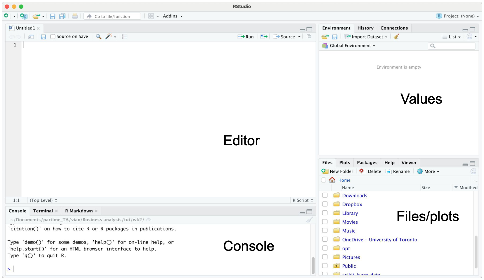
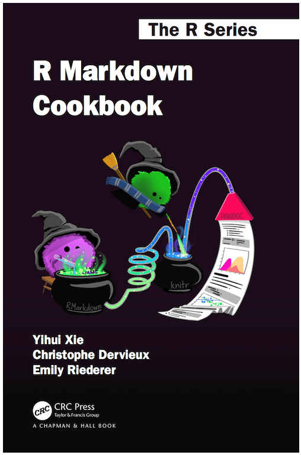

```{r setup, include=FALSE}
knitr::opts_chunk$set(echo = TRUE)
```

# Methods and computing camp

This summer we will together learn and review materials of statistical computing and methods. 


# What do we do during lectures?

Materials will be available at course website.  Lecture notes are created by Rmarkdown.  

- **If you have questions, feel free to interrupt or send a message in the chat.**

We will cover 10 modules of statistical methods and computing.  

- Each module takes ~1 hour.

# What contents we will cover?

{height=80%}

# What contents we will not cover?

- Nonparametric inference (STA3000) 
- Bayesian inference (STA3000, STA2201)
- Computing of Bayesian inference (STA2201)
- Shiny and blogdown in R

# Exercises!

- Available before each module. 
- Exercises can be difficult. 
- Group discussion is recommended. 
- Solutions are released during the last 10-20 mins. 

# Module 1: Basic programming in R

We will review R, Rstudio, and Syntax of R together. 

- Rstudio (Knit)
- Basic data types
- Basic data structures
- Functions
- For loops

Useful resources:

- [Tidyverse style guide](https://style.tidyverse.org/index.html)
- [The R Inferno](https://www.burns-stat.com/pages/Tutor/R_inferno.pdf)

# Introduction to R and Rstudio

R is a free statistical software.  We use R frequently/intensively during our study.

First please download R and its IDE Rstudio (if you haven't).

- https://www.r-project.org/
- https://www.rstudio.com/

# Studio

- Editor: edit or save the file.
- Console: outputs.
- Values: store values of assigned.
- Files/plots/packages/help.
  
{height=60%}

# How to set working directory? 

Working directory is important since you might want to read and import data from other files.  It is recommended to put these files under the same directory with your scripts. 

- Method 1: Session -> set working directory.            
- Method 2: Files -> Navigate to your directory.
- Method 3: `setwd()`.

Alternatives: Set R.project.

# How to install packages? 

Common packages in statistical analysis with R:

- tidyverse/dpylr
- ggplot
- kableExtra or gridExtra
- glm

Several options to install packages:

- Method 1: Tools -> install packages
- Method 2: Packages window. 
- Method 3: `install.packages()`.

# Ready with your Rstudio?

Let's code! 

# Vector 

Can contain numerical, string, or Boolean value. 

Store data = make an assignment.  `c()` is for component. 

```{r}
v <- c(TRUE, FALSE, TRUE, TRUE, FALSE)
v <- c("python", "mathlab", "R") 
v <- c(6, 5, 4, 3, 2, 1)
```

Are you familiar with the output of these?

```{r}
which(v == 3)
```

```{r, eval = F}
v[2]
v[-2]
v[2:3]
v[v < 4]
which(v == 3)
```

# Matrix

```{r}
mymat <- matrix(c(1:10), nrow = 2, ncol = 5, 
                byrow = TRUE)
```

```{r}
mymat[2, ]
```

```{r, eval = F}
mymat <- matrix(c(1:10), nrow = 2, ncol = 5, 
                byrow = TRUE)
mymat
mymat[1, 5]
mymat[2, ]
mymat[c(1:2), c(1:2)]
```

# Data frame

```{r}
studentID <- c(1, 2, 3, 4)
age <- c(17, 18, 16, 19)
gender <-c("M", "F", "M", "M")
studentData <- data.frame(studentID, age, gender)
```

```{r}
rownames(studentData) <- c("A", "B", "C", "D")
```

```{r}
colnames(studentData) <- c("ID", "age", "gender")
studentData
```

# Linear Regression

$y_i = \beta^T x_i + \epsilon_i$

```{r}
x <- c(1:5)
eps <- rnorm(5)
y <- 2*x + eps
mod <- lm(y ~ x)
```

# Linear Regression
\footnotesize
```{r}
summary(mod)
```

# List

```{r}
g <- "My List"
h <- c(2, 3, 5, 7)
j <- matrix(1:10, nrow = 5, byrow = FALSE)
k <- c("one", "two", "three")
mylist <- list(title = g, ages = h, j, k)
```

```{r}
mylist[[2]]
```

```{r}
mylist$ages
mylist[[1]] 
```

# Plotting 

\tiny

```{r, out.width = "80%"}
y <- c(5, 4, 2, 3, 1) 
x <- c(1, 2, 3, 4, 5)
plot(x, y, type = "l")
```

# Other

\footnotesize

Important for stats research. 

- `floor(v)`, `ceiling(v)`
- `round(v, 2)`
- `rnorm()`, `rexp()`, `rbinom()`, etc generate random variable 
- Function
 
```{r}
rnorm(5, mean = 0, sd = 1) # 5 random numbers from N(0, 1)
```
 
```{r}
round(2.333333, 2)
```

```{r}
func <- function(x1, x2) {
   y <- 3 * x1^2 + 3 * x2^2 - 2* x1^2 *x2
   return(y)
}
func(1, 2)
```

# If else

What is the output?

```{r, eval = F}
p <- 3
if (p <= 2) {
  print("p <= 2!")
} else {
  print("p > 2!")
}
```

# for loop

```{r}
v <- c(1, 2, 4, 3) 
w <- c(0, 0, 0, 0) 
t <- 0

for (i in v) {
  t <- t + 1
  w[t] <- w[t] + i 
  print(w)
}

w
```

# while loop

```{r}
i <- 1
while (i <= 10) {
  print(i)
  i <- i + 1
}
```

# next 

```{r}
alphabet <- LETTERS[1:6] 
for (i in alphabet) {
  if(i == 'D') {
    next 
  }
 print(i) 
}
```

# break

```{r}
alphabet <- LETTERS[7:12] 
for (i in alphabet) {
  if (i == 'K') {
    break 
  }
  print(i) 
}
```

# apply

 It can be applied on matrix, vector, data frame, and loop through row or column (defined by the second input - `MARGIN`). 

Syntax: `apply(X, MARGIN, FUN, ...)`

\tiny
```{r}
f <- function(x) {
  ts <- 2*x^2
  return(ts)
}

ii <- matrix(1:4, nrow = 1)
apply(ii, 1, f)
```

# Knit in Rstudio 

Common types of R files: `.R`, `.Rmd`

- Simulations, e.g. for loops, functions, I use `.R`
- Reporting, analysis, plotting, I use `.Rmd`

Rmd file can be converted to pdf, html through `Knit`. 

- yaml style. 

```{r, eval = F}
---
title: 'Module 1: Basic programming in R'
date: "04/15/2022"
output:
  beamer_presentation
---
```

# More yaml style 

```{r, eval = F}
---
title: "A summary of xx"
date: "02/14/2022"
output: 
  pdf_document:
    toc: true
    number_sections: true
---
```

# Resource

- "R Markdown Cookbook" by Yihui Xie. 
- https://bookdown.org/yihui/rmarkdown-cookbook/

{height=50%}

# Code style 

- [Google’s R Style Guide](https://google.github.io/styleguide/Rguide.html) 
- ``styler`` software embedded in Rstudio - allows you to interactively restyle selected text, files, or entire projects.
- ``Lintr`` software embedded in Rstudio - performs automated checks to confirm that you conform to the style guide. 


# Exercise 

Available on course website. 

1. Matrix and vector operations - generate a $100 \times 100$ matrix for matrix inverse calculation. 

2. For loops 
