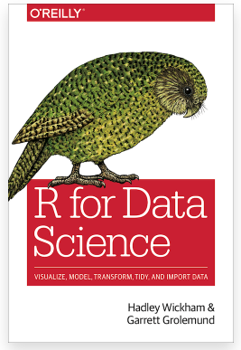

```{r setup, include=FALSE}
knitr::opts_chunk$set(echo = TRUE)
```

# Outline

We will review R, Rstudio, and Syntax of R together. 

- LaTeX/Markdown
- Tidy data, processing (tidyverse)
- Graphing (ggplot2)

# LaTeX and Markdown

LaTeX is useful for documents with mathematical formulas. 

- [Overleaf](www.overleaf.com) - an online, collaborative LaTeX editor 
- LaTeX mathematical symbols
- Inline equation e.g. (`$\alpha$`) returns $\alpha$
- Equation e.g. (`$$e = mc^2$$`) returns $$e = mc^2$$

Markdown is appealing for formatting, e.g. headings, bold text, text with codes, ...

# Resources

"R for Data Science: Import, Tidy, Transform, Visualize, and Model Data" by Hadley Wickham.  

{height=50%}
# Data import

\tiny
```{r}
df <- read.table("mtcars.txt", header = TRUE)
head(df) # Show the first 6 rows. 
```

# Other options 

CSV files. 

- base::read.csv() in the base r.
- readr::read.csv() in "readr" package (much faster). 
- data.table::fread() in  "data.table" package (much more faster). 

Rdata. 

- load() in the base r. 

# Tidy data 

The goal is to clean the dataset so it is much easier to use. 

Specifically, 

- Each variable must have its own column.
- Each observation must have its own row. 
- Each value must have its own cell. 

We will focus on the functions from "tidyverse" package. 


```{r, message=FALSE}
library(tidyverse)
```


# Tidy data 1: pivoting 

For a dataset having column names are not names of variables, but values of a variable, e.g. 

\tiny
```{r}
table4a
```

- Need to change 1999, 2000 to a column? named as "year".
- Need to change the values of 1999, 2000 as "cases". 

We can use `pivot_longer()` from the "tidyverse" package. 

# Pivot longer

\tiny
```{r}
table4a %>% 
  pivot_longer(c(`1999`, `2000`), 
               names_to = "year", values_to = "cases")
```

# Another example 

\tiny
```{r}
table2 %>% head(5)
```

- case and population are two variables and should be converted into columns. 

We can use `pivot_wider()`.

# Pivot wider

\tiny
```{r}
table2 %>%
    pivot_wider(names_from = type, values_from = count)
```

# Transform data

Use the "pipes" from the "tidyverse" package, a powerful tool for clearly expressing a sequence of multiple operations, with the combination of the following functions:

- `select()`
- `filter()`
- `arrange()`
- `mutate()`
- `summarise()`
- `group_by()`

# Dataset - Diamonds

A dataset containing the prices and other attributes of almost 54,000 diamonds. 

\tiny
```{r}
head(diamonds)
```

# Select

Use `select()` to get a column, e.g. "color"

\tiny
```{r}
diamonds %>%
  select(color) %>%
  head()
```

```{r}
# Equivalent to...
head(diamonds$color)
```


# Select

Use `select()` to remove a column, e.g. "color"

\tiny
```{r}
diamonds %>%
  select(-color)
```

```{r, eval = F}
# Need to assign the change to the original dataset, otherwise, the deletion won't affect the dataset.
diagmonds <- diamonds %>%
  select(-color)
```

# Filter 

Use `filter()` to filter by some condition, e.g. filter all price > 335

\tiny
```{r}
diamonds %>%
  filter(price > 335)
```

# Filters with multiple conditions 

\tiny

```{r}
diamonds %>%
  filter(price > 335 & depth < 64)
```

# Filters with multiple conditions 

\tiny

```{r}
diamonds %>%
  filter(cut == "Very Good" | cut == "Fair")
```

# Filter after select

This is an example of "a sequence of operations". 

\tiny
```{r}
diamonds %>%
  select(price) %>%
  filter(price > 335)
```

# Arrange 

Use `arrange()` to order data. 

\tiny
```{r}
diamonds %>%
  arrange(price)
```

# Arrange descending order

e.g. from the cheapest! 

\tiny
```{r}
diamonds %>%
  arrange(-price)
```

# Arrange by multiple conditions 

\tiny
```{r}
diamonds %>%
  arrange(price, cut)
```

# Filter, select, arrange 

\tiny
```{r}
diamonds %>%
  filter(table < 340) %>%
  select(carat, cut, price) %>%
  arrange(price, cut)
```

# Mutate 

Create new variables using `mutate()`.

- Create a boolean variable, 0 = not affordable, 1 = affordable. 

\tiny
```{r}
diamonds %>%
  mutate(affordable = price < 400) 
```

# Mutate (cont'd)

- Create a variable containing string with `case_when()`:

\tiny
```{r}
diamonds %>%
  mutate(affordable = case_when(price<400 ~ "affordable", 
                                TRUE ~ "not affordable")) 
```

# Group by and Summarise

Use `group_by` and `summarise` to group variables:

\tiny
```{r}
diamonds %>%
  group_by(cut) %>%
  summarise(n = n())
```

# More examples

\tiny
```{r}
diamonds %>%
  group_by(cut) %>%
  summarise(n = n(), price_avg = mean(price))
```

# Proportions 

\tiny
```{r}
diamonds %>%
  group_by(cut) %>%
  summarise(n = n(), price_avg = mean(price)) %>%
  ungroup() %>%
  mutate(prop = n/sum(n))
```

# With percentage

Use `scales::percent()` to add `%`.

\tiny
```{r}
diamonds %>%
  group_by(cut) %>%
  summarise(n = n(), price_avg = mean(price)) %>%
  ungroup() %>%
  mutate(prop = scales::percent(n/sum(n)))
```

# Graphing after transformation

\tiny
```{r, fig.width=4, fig.height= 2}
diamonds %>%
  group_by(cut) %>%
  summarise(n = n(), price_avg = mean(price)) %>%
  ggplot() +
  geom_bar(aes(x = cut, y = n), stat = "identity")
```

# ggplot

Here we used functions from "ggplot2" package. Same pattern as "tidyverse", but using "+" to connect. 

How to write? 

- Specify the data using `ggplot(data = diamonds)`
- Specify the x-/y-axis, `ggplot(data = diamonds, mapping = aes(x = cut))`
- Specify the types of plots with `geom`, e.g. `+ geom_bar()`

```{r, eval = F}
ggplot(data = diamonds) +
  geom_bar(mapping = aes(x = cut))
```

# More plots

- `geom_histogram()`, `geom_density()`, `geom_line()`, `geom_point()`
- `geom_facet()` generates subplots 
- color package 
  - "RColorBrewer"
  - "ggsci"

# Resources

This module is based on

- Brendan R. E. Ansell's "Introduction to R - tidyverse" [[link]](https://bookdown.org/ansellbr/WEHI_tidyR_course_book/) 
