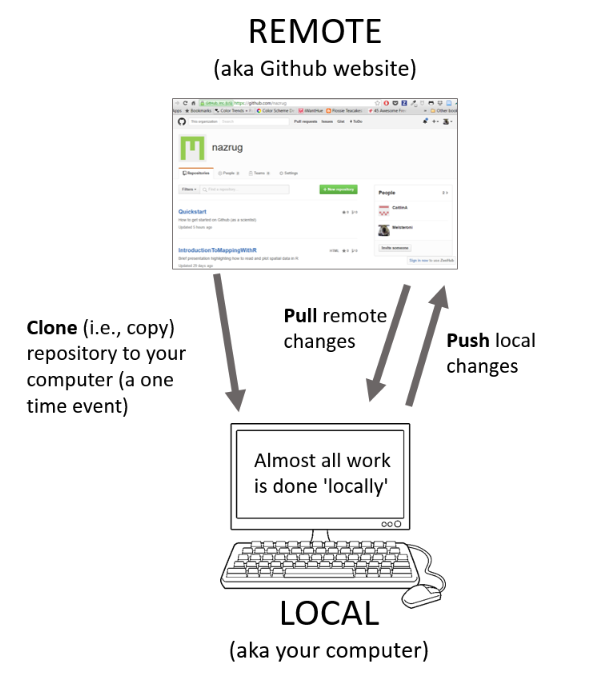

```{r setup, include=FALSE}
knitr::opts_chunk$set(echo = TRUE, warning = FALSE, message = FALSE)
```

# Outline 

Last module we reviewed how to tidy and plot data. 

In this module, we will continue our discussion on

- Graphing (ggplot2) with a real-world dataset
- Git + Github


# ggplot

- `ggplot` is the graphing package that goes with the `tidyverse` in R
- Very powerful to make a wide range of graphics
- Same pattern as `tidyverse`"`, but using "+" to connect. 

How to write? 

- Specify the data using 

  `ggplot(data = diamonds)`
  
- Specify the x-/y-axis, 

  `ggplot(data = diamonds, mapping = aes(x = cut))`
  
- Specify the types of plots with `geom`, e.g. 

  `+ geom_bar()`

# Data used - palmerpenguins

The `palmerpenguins` is a R package with data from the Long Term Ecological Research Network. It contains two datasets for 344 penguins and 3 species of penguins from 3 islands in the Palmer Archipelago, Antarctica. 

{height=70%}

# Install and load package

From what we have learned so far, how to install package? What packages are we going to use? 

\pause

```{r, eval = F}
install.packages("palmerpenguins")
```

```{r}
library(tidyverse)
library(palmerpenguins)
```


# Skim the data

How many observations? How many variables? What type? 

\pause

```{r}
head(penguins)
```

# Scatter plot 

Consider a scatter plot of flipper length and body mass for `species = "Adelie"`

First let's prepare the data to plot (Hint: filter). 

\pause

```{r}
pdata <- penguins %>%
  filter(species == "Adelie")
```

# A blank canvas

`aes` stands for aesthetic and tells ggplot the main characteristics of your plot (x, y, and if the color or fill vary by group)

\tiny
```{r, out.height = '60%', fig.align = "center"}
ggplot(data = pdata, aes(x = flipper_length_mm, y = body_mass_g))
```

# Add the points 

Add layers with ggplot using the `+`

\tiny
```{r, out.height = '60%', fig.align = "center"}
ggplot(data = pdata, aes(x = flipper_length_mm, y = body_mass_g)) +
  geom_point()
```

# Tidy up labels

\tiny
```{r, out.height = '60%', fig.align = "center"}
ggplot(data = pdata, aes(x = flipper_length_mm, y = body_mass_g)) +
  geom_point() + 
  xlab("Flipper length (mm)") +
  ylab("Body mass (g)")
```


# Add a title

\tiny
```{r, out.height = '60%', fig.align = "center"}
ggplot(data = pdata, aes(x = flipper_length_mm, y = body_mass_g)) +
  geom_point() + 
  xlab("Flipper length (mm)") +
  ylab("Body mass (g)") +
  labs(title = "Penguin size, Palmer Station LTER")
```

# Subtitle

\tiny
```{r, out.height = '60%', fig.align = "center"}
ggplot(data = pdata, aes(x = flipper_length_mm, y = body_mass_g)) +
  geom_point() + 
  xlab("Flipper length (mm)") +
  ylab("Body mass (g)") +
  labs(title = "Penguin size, Palmer Station LTER",
       subtitle = "Flipper length and body mass for Adelie")
```


# Change color of points

To see all colors, type `colors()`

\tiny
```{r, out.height = '60%', fig.align = "center"}
ggplot(data = pdata, aes(x = flipper_length_mm, y = body_mass_g)) +
  geom_point(color = "darkorange") + 
  xlab("Flipper length (mm)") +
  ylab("Body mass (g)") +
  labs(title = "Penguin size, Palmer Station LTER",
       subtitle = "Flipper length and body mass for Adelie")
```

# Size of points 

\tiny
```{r, out.height = '60%', fig.align = "center"}
ggplot(data = pdata, aes(x = flipper_length_mm, y = body_mass_g)) +
  geom_point(color = "darkorange",
             size = 3, 
             alpha = 0.8) + 
  xlab("Flipper length (mm)") +
  ylab("Body mass (g)") +
  labs(title = "Penguin size, Palmer Station LTER",
       subtitle = "Flipper length and body mass for Adelie")
```

# Coloring by group 

Now use the whole data `penguins`. Specifying the color in `aes()` because it **depends on the data**.

\tiny
```{r, out.height = '60%', fig.align = "center"}
ggplot(data = penguins, aes(x = flipper_length_mm, y = body_mass_g, color = species)) +
  geom_point(size = 3, alpha = 0.8) + 
  xlab("Flipper length (mm)") +
  ylab("Body mass (g)") +
  labs(title = "Penguin size, Palmer Station LTER",
       subtitle = "Flipper length and body mass for Adelie")
```

# Change the color manually by group 

Specifying the color in `aes()` because it **depends on the data**.

\tiny
```{r, out.height = '60%', fig.align = "center"}
ggplot(data = penguins, aes(x = flipper_length_mm, y = body_mass_g, color = species)) +
  geom_point(size = 3, alpha = 0.8) +
  scale_color_manual(values = c("darkorange","purple","cyan4")) + 
  xlab("Flipper length (mm)") +
  ylab("Body mass (g)") +
  labs(title = "Penguin size, Palmer Station LTER",
       subtitle = "Flipper length and body mass for Adelie")
```

# Change the theme

\tiny
```{r, out.height = '60%', fig.align = "center"}
ggplot(data = penguins, aes(x = flipper_length_mm, y = body_mass_g, color = species)) +
  geom_point(size = 3, alpha = 0.8) +
  scale_color_manual(values = c("darkorange","purple","cyan4")) + 
  xlab("Flipper length (mm)") +
  ylab("Body mass (g)") +
  labs(title = "Penguin size, Palmer Station LTER",
       subtitle = "Flipper length and body mass for Adelie") +
  theme_bw()
```

# Change the color scheme

Optional: try `ggsci` functions.

\tiny
```{r, out.height = '60%', fig.align = "center"}
ggplot(data = penguins, aes(x = flipper_length_mm, y = body_mass_g, color = species)) +
  geom_point(size = 3, alpha = 0.8) +
  xlab("Flipper length (mm)") +
  ylab("Body mass (g)") +
  labs(title = "Penguin size, Palmer Station LTER",
       subtitle = "Flipper length and body mass for Adelie") +
  theme_bw() +
  scale_color_viridis_d()
```

# Other plot types?

Other types are also available, e.g. histograms, bar charts, box plots, line graphs and scatter plots. 

# Histograms

\tiny
```{r, out.height = '60%', fig.align = "center"}
ggplot(data = penguins, aes(x = flipper_length_mm, fill = species)) +
  geom_histogram(alpha = 0.8) +
  scale_fill_manual(values = c("darkorange","purple","cyan4")) +
  xlab("Flipper length (mm)") +
  ylab("Frequency") +
  labs(title = "Penguin flipper lengths") +
  theme_bw() 
```

# Histogram

Try `binwidth = ` and `bins == `

\tiny
```{r, out.height = '60%', fig.align = "center"}
ggplot(data = penguins, aes(x = flipper_length_mm, fill = species)) +
  geom_histogram(binwidth = 1, alpha = 0.8) +
  scale_fill_manual(values = c("darkorange","purple","cyan4")) +
  xlab("Flipper length (mm)") +
  ylab("Frequency") +
  labs(title = "Penguin flipper lengths") +
  theme_bw() 
```

# Boxplots

\tiny
```{r, out.height = '60%', fig.align = "center"}
ggplot(data = penguins, aes(x = species, y = flipper_length_mm)) +
  geom_boxplot(show.legend = FALSE) +
  xlab("Flipper length (mm)") +
  ylab("Frequency") +
  labs(title = "Penguin flipper lengths") +
  theme_bw() 
```

# Barcharts 

First, try to summarize the penguin data by species and returns the proportion of each penguin types. 

\pause

\tiny
```{r}
gplot <- penguins %>% 
  group_by(species) %>% 
  tally() %>% 
  mutate(prop = n / sum(n))
gplot
```
# Barcharts 

\tiny
```{r, out.height = '60%', fig.align = "center"}
ggplot(data = gplot, aes(x = species, y = prop))  + 
  geom_bar(stat = "identity") + 
  xlab("Species") +
  ylab("Proportions") +
  labs(title = "Penguin species") +
  theme_bw() 
```

# Faceting

\tiny
```{r, out.height = '60%', fig.align = "center"}
ggplot(penguins, aes(x = flipper_length_mm, y = body_mass_g)) +
  geom_point(aes(color = sex)) +
  scale_color_manual(values = c("darkorange","cyan4"), na.translate = FALSE) +
  labs(title = "Penguin flipper and body mass",
       subtitle = "Dimensions for male and female Adelie, Chinstrap and Gentoo Penguins at Palmer Station LTER",
       x = "Flipper length (mm)",
       y = "Body mass (g)",
       color = "Penguin sex") +
  facet_wrap(~species)
```

# Git + Github

What is Git? 

- A control system to manage projects 
- Good for tracking history

\pause

What about Github?

- Cloud-based service for managing Git repositories
- Useful for teamwork
- Just like "Dropbox"

# Why Git + Github?

- You can undo anything
- You won't need to keep undo-ing things (merge/load difference)
- You can identify exactly when and where changes were made
- Teamwork

# Some github terminology 

- User: A Github account for you (e.g., jules32).
- Organization: The Github account for one or more user (e.g., datacarpentry).
- Repository: A folder within the organization that includes files dedicated to a project.
- Local Github: Copies of Github files located your computer.
- Remote Github: Github files located on the https://github.com website.

# Basic Git commands and workflow

When you are working on a your local machine you typically get started by:

- `git clone`: Cloning a remote repository to work on locally. This is a way to work with an ongoing project or edit someone else's project that is available remotely (aka on GitHub).

From there, the typical workflow involves:

- `git add`: Adding files to your repo
- `git commit`: Commiting changes you have made
- `git push`: Pushing changes to a remote repository (aka GitHub)

For a collaborative project, or work between desktop and personal laptop, you would use the following first before `git add`

- `git pull`: Pulling changes from a remote repository 

# Illustration diagram



# Let's Git

Download Github and set up your github profile. 

- Github Desktop, a GUI for using Github [[link]](https://docs.github.com/en/desktop)
- (Optional) Learn how to use command line for Github management
  - Command line tutorial [[link]](https://ubuntu.com/tutorials/command-line-for-beginners#3-opening-a-terminal)


# Resources

This tutorial is based on 

- Monica Alexander's ggplot tutorial [[link]](https://github.com/MJAlexander/applied-stats-2022/blob/main/labs/2_eda_extra_ggplot.Rmd) 

- Jesse Gronsbell's Github tutorial [[link]](https://github.com/jlgrons/JSC270_Lab3/blob/main/JSC270_Git.ipynb) 


Other resources: https://kbroman.org/github_tutorial/pages/resources.html
