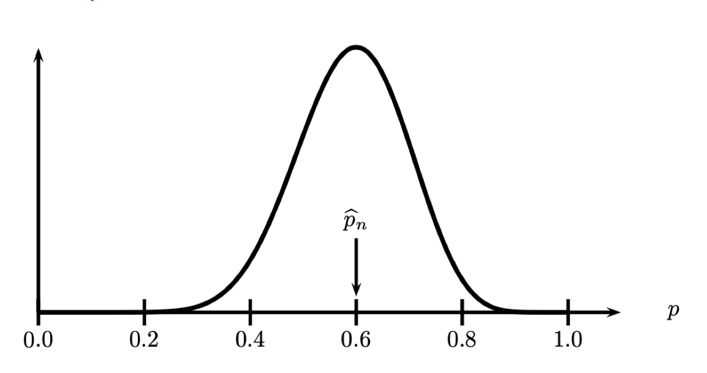
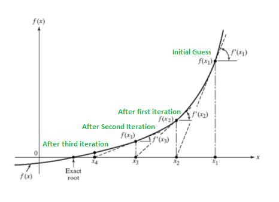

```{r setup, include=FALSE}
knitr::opts_chunk$set(echo = TRUE)
```

# Outline

This module we will review

-   Basics of parametric inference
-   Methods for generating parametric estimators
-   Maximum likelihood estimators
-   Delta method
-   Optimization method for finding MLE in R (Newton-Raphson, EM
    algorithm)

# Parametric inference

::: block
### Definition (Parametric models)

$$
\mathfrak{F}=\{f(x ; \theta): \theta \in \Theta\}
$$ where the $\Theta \subset \mathbb{R}^{k}$ is the parameter space and
$\theta=\left(\theta_{1}, \ldots, \theta_{k}\right)$ is the parameter.
:::

Goal of parametric inference

-   estimate the parametric $\theta$ (assume we known the form of the
    density).

# Parameter of interest and nuisance parameter

Often, we are interested in estimating some function $T(\theta)$.

For example, if $X \sim N(\mu, \sigma^2)$, then

-   Parameters: $\theta = (\mu, \sigma)$
-   Parameter space:
    $\Theta = \{(\mu, \sigma): \mu \in \mathbb{R}, \sigma > 0\}$

If the goal is to estimate the $\mu$ then

-   Parameter of interest: $T(\theta) = \mu$
-   Nuisance parameter: $\sigma$

# Methods for generating parametric estimators

1.  Method of moments
2.  Maximum likelihood

# Method of moments

::: block
### Definitions

-   $\mathbb{E}(X^k)$ is the $k^{th}$ (theoretical) moment of the
    distribution, for $k = 1,2,...$
-   $M_k = \frac{1}{n} \sum_{i = 1}^n X_i^k$ is the $k^{th}$ sample
    moment, for $k = 1,2,...$
:::

# Steps to find MoM

The basic idea behind this form of the method is to:

-   Equate the first sample moment about the origin
    $M_1 = \frac{1}{n} \sum_{i = 1}^n X_i = \bar{X}$ to the first
    theoretical moment $\mathbb{E}(X)$.
-   Equate the second sample moment about the origin
    $M_2 = \frac{1}{n} \sum_{i = 1}^n X_i^2$ to the second theoretical
    moment $\mathbb{E}(X^2)$.
-   Continue equating sample moments about the origin until you have as
    many equations as you have parameters.
-   Solve for the parameters

# Example of MoM (Bernoulli)

Let $X_1, ..., X_n$ be Bernoulli random variables with parameter $p$.
What is the method of moments estimator of $p$?

\pause

Only one parameter $p$, so we only need to equate the first moment.

$\mathbb{E}(X_i) = p = M_1 = \frac{1}{n} \sum_{i=1}^n X_i = \bar{X}$.

So, $$
\hat{p}_{MoM} = \bar{X}
$$

# Example of MoM (Normal)

Let $X_1, ..., X_n$ be normal random variables with mean $\mu$ and
variance $\sigma^2$. What are the method of moments estimators of the
mean $\mu$ and variance $\sigma^2$ ?

\pause

Two parameters, so we need to equate the first and the second moment.

$E(X_i) = \mu = M_1, E(X_i^2) = \sigma^2 + \mu^2 = M_2$.

So, $$
\hat{\mu}_{MoM} = \bar{X}, \hat{\sigma}^2_{MoM} = \frac{1}{n}\sum_{i=1}^nX_i^2 - \bar{X}^2.
$$

# Asymptotic properties

Under mild regularity conditions, MoM estimators are

-   *Consistent* $\rightarrow$ converge to the true value in probability
    as $n \rightarrow \infty$, i.e. $$
    \lim _{n \rightarrow \infty} P(|\hat{\theta}-\theta| \leq \epsilon)=1 \quad \forall \epsilon>0
    $$

-   *Asymptotically Normal*
    $\rightarrow \sqrt{n}(\hat{\theta}-\theta) \sim N\left(0, \sigma^{2}\right)$
    for large $n$

-   However, they are usually **NOT** *Asymptotically Efficient*

# Maximum likelihood

-   Parametric model: $f(x ; \theta)$, $X_{1}, \ldots, X_{n}$ iid

-   Likelihood function $$
    \mathcal{L}_{n}(\theta)=\prod_{i=1}^{n} f\left(X_{i} ; \theta\right)
    $$

-   The log-likelihood function

$$\ell_{n}(\theta)=\log \mathcal{L}_{n}(\theta) =\sum_{i=1}^{n} \log f\left(X_{i} ; \theta\right)$$

-   The maximum likelihood estimator (MLE) $$
    \hat{\theta}_{M L E}=\arg \max _{\theta} \mathcal{L}(\theta)
    $$

# An example of MLE



Likelihood function for Bernoulli with $n=20$ and
$\sum_{i=1}^{n} X_{i}=12$. The MLE is $\widehat{p}_{n}=12 / 20=0.6$.

# Steps to find the MLE

1.  Write out the likelihood $$
    \mathcal{L}(\theta)=f\left(X_{1}, \ldots, X_{n} ; \theta\right)
    $$
2.  Simplify the log likelihood $$
    \ell(\theta)=\log \mathcal{L}(\theta)
    $$
3.  Take the derivative of $\ell(\theta)$ with respect to the parameter
    of interest, $\theta$ Set $=0$
4.  Solve for $\theta$ (get $\hat{\theta}_{M L E}$ )
5.  Check that $\hat{\theta}_{M L E}$ is a maximum
    $\left(\frac{\partial^{2}}{\partial \theta^{2}} \ell(\theta)<0\right)$

# Exercise

Suppose we have an iid sample $\left\{X_{1}, \ldots, X_{n}\right\}$ with
$X_{i} \sim \operatorname{Bernoulli}(p)$. Find the MLE for $p$.

\pause
1. The likelihood $$
\mathcal{L}_{n}(p)=\prod_{i=1}^{n} f\left(X_{i} ; p\right)=\prod_{i=1}^{n} p^{X_{i}}(1-p)^{1-X_{i}}=p^{S}(1-p)^{n-S}
$$ where $S=\sum_{i} X_{i}$

\pause
2. Log-likelihood $$
\ell_{n}(p)=S \log p+(n-S) \log (1-p)
$$

\pause
3. MLE $$
\ell'_{n}(p) = 0
$$ The MLE is $\widehat{p}_{n}=S / n$.

# Asymptotics of MLE

Under mild regularity conditions, MLEs are

-   *Consistent* $\rightarrow$ converge to the true value in probability
    as $n \rightarrow \infty$, i.e. $$
    \lim _{n \rightarrow \infty} P(|\hat{\theta}-\theta| \leq \epsilon)=1 \quad \forall \epsilon>0
    $$
-   *Asymptotically normal*
    $\rightarrow \sqrt{n}(\hat{\theta}-\theta) \sim N\left(0, \sigma^{2}\right)$
    for large $n$
-   *Asymptotically efficient*
-   *equivariant* $\rightarrow$ if $\hat{\theta}$ is the MLE for
    $\theta$ then $g(\hat{\theta})$ is the MLE for $g(\theta)$

# Asymptotic Efficiency

::: block
### Cramér--Rao bound

The variance of any *unbiased* estimator $\hat{\theta}$ of $\theta$ is
bounded by the reciprocal of the Fisher information $I(\theta):$ $$
\textrm{Var}(\hat{\theta}) \ge \frac{1}{I(\theta)},
$$ where
$I(\theta) = n \mathbb{E}\left[\left(\frac{\partial\ell}{\partial\theta}\right)^2\right]$.
:::

Both MoM estimators are asymptotically unbiased, but MLE estimators
achieves the CR lower bound.

# MLE in R

Sometimes, there is no closed-form solution, so we need to use
optimization methods to find the maximum of the log-likelihood.

-   `optim()` find values of some parameters that **minimizes** some
    function.
-   Newton-Raphson
-   EM-algorithm

# Example using optim()

\tiny

```{r}
set.seed(42) # For reproducibility
sample_data <- rbinom(1000, size = 1, prob = 0.3) # Assuming success probability of 0.3

# Log-likelihood function for Bernoulli distribution
log_likelihood_bernoulli <- function(p, data) {
  n <- length(data)
  log_likelihood <- sum(data * log(p) + (1 - data) * log(1 - p))
  return(-log_likelihood) # Negative to be used with optimization functions (minimization)
}

# Initial parameter value for optimization (probability of success)
initial_param <- 0.8

# Find MLE using optim
result <- optim(
  par = initial_param, fn = log_likelihood_bernoulli,
  data = sample_data, method = "Brent", lower = 0, upper = 1
)

# MLE estimate of p
mle_p <- result$par

# Print the result
cat("MLE of p:", mle_p, "\n")
```

# Newton-Raphson

Derivative of the log-likelihood around $\theta^j$ : $$
0=\ell^{\prime}(\widehat{\theta}) \approx \ell^{\prime}\left(\theta^{j}\right)+\left(\widehat{\theta}-\theta^{j}\right) \ell^{\prime \prime}\left(\theta^{j}\right)
$$ Solving for $\widehat{\theta}$ gives $$
\widehat{\theta} \approx \theta^{j}-\frac{\ell^{\prime}\left(\theta^{j}\right)}{\ell^{\prime \prime}\left(\theta^{j}\right)} .
$$ This suggests the following iterative scheme: $$
\widehat{\theta}^{j+1}=\theta^{j}-\frac{\ell^{\prime}\left(\theta^{j}\right)}{\ell^{\prime \prime}\left(\theta^{j}\right)}
$$

# Illustration



# NR algorithm in R

\tiny

```{r}
# First derivative of the log-likelihood function
log_likelihood_bernoulli_prime <- function(p, data) {
  n <- length(data)
  d_log_likelihood <- sum(data / p - (1 - data) / (1 - p))
  return(-d_log_likelihood) # Negative to be used with optimization functions (minimization)
}
# Second derivative of the log-likelihood function
log_likelihood_bernoulli_double_prime <- function(p, data) {
  n <- length(data)
  dd_log_likelihood <- sum(-data / p^2 - (1 - data) / (1 - p)^2)
  return(-dd_log_likelihood) # Negative to be used with optimization functions (minimization)
}
# Initial parameter value for optimization (probability of success)
initial_param <- 0.8
# Newton-Raphson algorithm for optimization
tolerance <- 1e-8
max_iterations <- 1000
p <- initial_param
for (i in 1:max_iterations) {
  p_new <- p - log_likelihood_bernoulli_prime(p, sample_data) /
    log_likelihood_bernoulli_double_prime(p, sample_data)
  if (abs(p_new - p) < tolerance) {
    break
  }
  p <- p_new
}
# Print the result
cat("MLE of p:", p, "\n")
```

# Solution Trajectory

```{r, echo=FALSE}
# Sample data (replace this with your observed data)
set.seed(42) # For reproducibility
sample_data <- rbinom(100, size = 1, prob = 0.3) # Assuming success probability of 0.3

# Log-likelihood function for Bernoulli distribution
log_likelihood_bernoulli <- function(p, data) {
  n <- length(data)
  log_likelihood <- sum(data * log(p) + (1 - data) * log(1 - p))
  return(log_likelihood)
}

# First derivative of the log-likelihood function
log_likelihood_bernoulli_prime <- function(p, data) {
  n <- length(data)
  d_log_likelihood <- sum(data / p - (1 - data) / (1 - p))
  return(d_log_likelihood)
}

# Second derivative of the log-likelihood function
log_likelihood_bernoulli_double_prime <- function(p, data) {
  n <- length(data)
  dd_log_likelihood <- sum(-data / p^2 - (1 - data) / (1 - p)^2)
  return(dd_log_likelihood)
}

# Initial parameter value for optimization (probability of success)
initial_param <- 0.8

# Newton-Raphson algorithm for optimization
tolerance <- 1e-8
max_iterations <- 1000
p <- initial_param
p_values <- c(p) # To store the trajectory of updates
log_likelihood_values <- c(log_likelihood_bernoulli(p, sample_data)) # To store the log-likelihood values

for (i in 1:max_iterations) {
  p_new <- p - log_likelihood_bernoulli_prime(p, sample_data) / log_likelihood_bernoulli_double_prime(p, sample_data)
  p_values <- c(p_values, p_new) # Store the updated p
  log_likelihood_values <- c(log_likelihood_values, log_likelihood_bernoulli(p_new, sample_data)) # Store the log-likelihood value for the updated p
  if (abs(p_new - p) < tolerance) {
    break
  }
  p <- p_new
}

# MLE estimate of p
mle_p <- p

# Plotting the likelihood function
likelihood_function <- function(p) {
  return(log_likelihood_bernoulli(p, sample_data))
}

p_grid <- seq(0, 1, length.out = 100)
likelihood_values <- sapply(p_grid, likelihood_function)

plot(p_grid, likelihood_values, type = "l", xlab = "p", ylab = "Likelihood", main = "Likelihood Function", col = "blue")

# Plotting the solution trajectory during updates
iterations <- length(p_values)

# Aligning 'p_values' and 'log_likelihood_values' to have the same length
log_likelihood_values_at_p_values <- sapply(p_values, function(p) log_likelihood_bernoulli(p, sample_data))

for (i in 1:(iterations - 1)) {
  points(p_values[i], log_likelihood_values_at_p_values[i], col = "blue", pch = 16)
  lines(c(p_values[i], p_values[i + 1]), c(log_likelihood_values_at_p_values[i], log_likelihood_values_at_p_values[i + 1]), col = "blue")
}

points(mle_p, log_likelihood_bernoulli(mle_p, sample_data), col = "red", pch = 19)
legend("topright", legend = c("Updates", "MLE"), col = c("blue", "red"), pch = c(16, 19), lty = c(1, NA), cex = 0.8)
```

# Expectation-Maximization (EM) algorithm

-   We will introduce the expectation-maximization (EM) algorithm in the
    context of Gaussian mixture models.
-   Let $N(\mu, \sigma^2)$ denote the probability distribution function
    for a normal random variable.
-   In this scenario, we have that the conditional distribution
    $X_i|Z_i = k \sim N(\mu_k, \sigma^2_k)$

# Likelihood Function

The marginal distribution of each $X_i$ is

$$
P(X_i = x) = \sum_{k=1}^KP(Z_i =k)P(X_i = x|Z_i = k) = \sum_{k=1}^K \pi_kN(x;\mu_k,\sigma_k^2)
$$

Given the data is independent, the likelihood is

$$
L(\theta|X_1,…, X_n) = \prod_{i=1}^n \left[ \sum_{k=1}^K \pi_kN(x_i;\mu_k,\sigma_k^2) \right]
$$

and the log-likelihood is

$$
\ell(\theta) = \sum_{i=1}^n \log\left[\sum_{k=1}^K \pi_kN(x;\mu_k,\sigma_k^2)\right]
$$

where
$\theta = \{\mu_1,...,\mu_k,\sigma_1,...,\sigma_k,\pi_1,...,\pi_k\}$.

# Complete Likelihood

The complete likelihood takes the form

$$
P(X, Z \mid \mu, \sigma, \pi)=\prod_{i=1}^n \prod_{k=1}^K \pi_k^{I\left(Z_i=k\right)} N\left(x_i \mid \mu_k, \sigma_k\right)^{I\left(Z_i=k\right)}
$$

so the complete log-likelihood takes the form:

$$
\log (P(X, Z \mid \mu, \sigma, \pi))=\sum_{i=1}^n \sum_{k=1}^K I\left(Z_i=k\right)\left(\log \left(\pi_k\right)+\log \left(N\left(x_i \mid \mu_k, \sigma_k\right)\right)\right)
$$

# E-step

In practice, we do not observe the latent variables, so we consider the
expectation of the complete log-likelihood with respect to the posterior
of the latent variables. The expected value of the complete
log-likelihood is therefore:

\small

$$
\begin{aligned}
& E_{Z \mid X}[\log (P(X, Z \mid \mu, \sigma, \pi))] \\
& =E_{Z \mid X}\left[\sum_{i=1}^n \sum_{k=1}^K I\left(Z_i=k\right)\left(\log \left(\pi_k\right)+\log \left(N\left(x_i \mid \mu_k, \sigma_k\right)\right)\right)\right] \\
& =\sum_{i=1}^n \sum_{k=1}^K P\left(Z_i=k \mid X\right)\left\{\log \left(\pi_k\right)+\log \left[N\left(x_i \mid \mu_k, \sigma_k\right)\right]\right\}
\end{aligned}
$$

Note that $P(Z_i=k|X)$ is the posterior distribution of $Z_i$ given the
observations: $$
P\left(Z_i=k \mid X_i\right)=\frac{P\left(X_i \mid Z_i=k\right) P\left(Z_i=k\right)}{P\left(X_i\right)}=\frac{\pi_k N\left(\mu_k, \sigma_k^2\right)}{\sum_{k=1}^K \pi_k N\left(\mu_k, \sigma_k\right)}
$$

# M-estp

-   First choose initial values for $\mu,\sigma,\pi$ so you can compute
    $P\left(Z_i=k \mid X_i\right)$.

-   Then with $P\left(Z_i=k \mid X_i\right)$ fixed, maximize the
    expected complete log-likelihood above with respect to
    $\mu_k, \sigma_k, \pi_k$.

# Example (Mixture of Two Normal)

Assume we have $K=2$ components, so that: $$
\begin{gathered}
X_i \mid Z_i=0 \sim N(5,1.5) \\
X_i \mid Z_i=1 \sim N(10,2)
\end{gathered}
$$ The true mixture proportions will be $P\left(Z_i=0\right)=0.25$ and
$P\left(Z_i=1\right)=0.75$. First we simulate data from this mixture
model

# EM in R

```{r}
# mixture components
mu.true <- c(5, 10)
sigma.true <- c(1.5, 2)

# determine Z_i
Z <- rbinom(10000, 1, 0.75)
# sample from mixture model

X <- rnorm(10000,
  mean = mu.true[Z + 1],
  sd = sigma.true[Z + 1]
)
```

# EM in R

```{r, out.width="80%", fig.align='center'}
hist(X, breaks = 15)
```

# EM in R

```{r}
log_likelihood_mixture <- function(theta, data) {
  mu1 <- theta[1]
  mu2 <- theta[2]
  sigma1 <- theta[3]
  sigma2 <- theta[4]
  pi <- theta[5]

  n <- length(data)
  log_likelihood <- sum(
    log(pi * dnorm(data, mean = mu1, sd = sigma1) +
      (1 - pi) * dnorm(data, mean = mu2, sd = sigma2))
  )

  return(log_likelihood)
}
```

# EM in R

\tiny

```{r}
# E-step: Compute the component proportions for each data point
e_step <- function(data, mu1, mu2, sigma1, sigma2, pi) {
  p1 <- pi * dnorm(data, mean = mu1, sd = sigma1)
  p2 <- (1 - pi) * dnorm(data, mean = mu2, sd = sigma2)

  # Compute the proportions for each data point
  proportions <- p1 / (p1 + p2)

  return(proportions)
}

# M-step: Update the parameters (means, variances, and mixture proportion)
m_step <- function(data, proportions) {
  pi <- mean(proportions)
  mu1 <- sum(proportions * data) / sum(proportions)
  mu2 <- sum((1 - proportions) * data) / sum(1 - proportions)
  sigma1 <- sqrt(sum(proportions * (data - mu1)^2) / sum(proportions))
  sigma2 <- sqrt(sum((1 - proportions) * (data - mu2)^2) / sum(1 - proportions))
  return(c(mu1, mu2, sigma1, sigma2, pi))
}
```

# EM in R

\tiny

```{r}
# EM algorithm to estimate means and variances
em_algorithm <- function(data, max_iterations = 1000, tolerance = 1e-8, initial_params = NULL) {

  # Initial guesses for the parameters
  if (is.null(initial_params)) {
    initial_params <- c(mean(data), mean(data), sd(data), sd(data), 0.5)
  }

  params <- initial_params
  log_likelihood_prev <- -Inf

  for (i in 1:max_iterations) {
    # E-step: Compute the component proportions
    proportions <- e_step(data, params[1], params[2], params[3], params[4], params[5])

    # M-step: Update the parameters
    new_params <- m_step(data, proportions)

    # Compute the log-likelihood to check for convergence
    log_likelihood <- log_likelihood_mixture(new_params, data)

    # Check for convergence
    if (abs(log_likelihood - log_likelihood_prev) < tolerance) {
      cat("Total Number of Iterations:", i, "\n")
      break
    }


    # Update parameters and log-likelihood
    params <- new_params
    log_likelihood_prev <- log_likelihood
  }
  return(params)
}
```

# EM in R

\tiny

```{r}
# Run the EM algorithm on the generated data
estimated_params <- em_algorithm(X)

# Print the estimated parameters
cat("Estimated mean 1:", estimated_params[1], "\n")
cat("Estimated mean 2:", estimated_params[2], "\n")
cat("Estimated variance 1:", estimated_params[3]^2, "\n")
cat("Estimated variance 2:", estimated_params[4]^2, "\n")
cat("Estimated mixture proportion:", estimated_params[5], "\n")
```

# What happened?

-   There is no guarantee that the EM algorithm converges to a global
    maximum of the likelihood.
-   To address this issue, one approach is to try different initial
    parameter values and run the EM algorithm multiple times.

# EM in R

\tiny

```{r}
# Run the EM algorithm with random initial parameter
estimated_params <- em_algorithm(X,
  initial_params = c(runif(2, min(X), max(X)), 
                    runif(2, 0, max(X) - min(X)), 
                    runif(1, 0, 1))
)

# Print the estimated parameters
cat("Estimated mean 1:", estimated_params[1], "\n")
cat("Estimated mean 2:", estimated_params[2], "\n")
cat("Estimated variance 1:", estimated_params[3]^2, "\n")
cat("Estimated variance 2:", estimated_params[4]^2, "\n")
cat("Estimated mixture proportion:", estimated_params[5], "\n")
```

# EM in R

\tiny

```{r}
# Run the EM algorithm with random initial parameter
estimated_params <- em_algorithm(X,
  initial_params = c(runif(2, min(X), max(X)), 
                    runif(2, 0, max(X) - min(X)), 
                    runif(1, 0, 1))
)

# Print the estimated parameters
cat("Estimated mean 1:", estimated_params[1], "\n")
cat("Estimated mean 2:", estimated_params[2], "\n")
cat("Estimated variance 1:", estimated_params[3]^2, "\n")
cat("Estimated variance 2:", estimated_params[4]^2, "\n")
cat("Estimated mixture proportion:", estimated_params[5], "\n")
```

# EM in R

\tiny

```{r}
# Run the EM algorithm with random initial parameter
estimated_params <- em_algorithm(X,
  initial_params = c(runif(2, min(X), max(X)), 
                    runif(2, 0, max(X) - min(X)), 
                    runif(1, 0, 1))
)

# Print the estimated parameters
cat("Estimated mean 1:", estimated_params[1], "\n")
cat("Estimated mean 2:", estimated_params[2], "\n")
cat("Estimated variance 1:", estimated_params[3]^2, "\n")
cat("Estimated variance 2:", estimated_params[4]^2, "\n")
cat("Estimated mixture proportion:", estimated_params[5], "\n")
```

# Delta method

::: block
### Theorem (The Delta Method).

Suppose that $$
\frac{\sqrt{n}\left(Y_{n}-\mu\right)}{\sigma} \rightsquigarrow N(0,1)
$$ and that $g$ is a differentiable function such that
$g^{\prime}(\mu) \neq 0$. Then $$
\frac{\sqrt{n}\left(g\left(Y_{n}\right)-g(\mu)\right)}{\left|g^{\prime}(\mu)\right| \sigma} \rightsquigarrow N(0,1) .
$$ In other words, $$
Y_{n} \approx N\left(\mu, \frac{\sigma^{2}}{n}\right) \quad \text { implies that } \quad g\left(Y_{n}\right) \approx N\left(g(\mu),\left(g^{\prime}(\mu)\right)^{2} \frac{\sigma^{2}}{n}\right) .
$$
:::

# Exercise

Let $X_{1}, \ldots, X_{n} \sim \operatorname{Bernoulli}(p)$ and let
$\psi=g(p)=\log (p /(1-$ $p)$ ). Find the MLE of $\psi$ and its asymptotic distribution. 

\pause

The MLE of $p$ was derived previously as follows
$$\hat{p}_{\text{MLE}} = \frac{1}{n} \sum_{i=1}^{n} X_i = \bar{X}$$
Now, for $\psi = g(p) = \log\left(\frac{p}{1-p}\right)$, the MLE of $\psi$ is obtained by plugging in the MLE of $p$:
$$\hat{\psi}_{\text{MLE}} = g(\hat{p}_{\text{MLE}}) = \log\left(\frac{\hat{p}_{\text{MLE}}}{1-\hat{p}_{\text{MLE}}}\right) = \log\left(\frac{\bar{X}}{1-\bar{X}}\right)$$

# Exercise

By the Central Limit Theorem, as $n \to \infty$:
$$\sqrt{n}(\bar{X} - E[X_i]) \xrightarrow{D} N(0, \operatorname{Var}(X_i))$$
Therefore,
$$\sqrt{n}(\hat{p}_{\text{MLE}} - p) \xrightarrow{D} N(0, p(1-p))$$

To apply delta method, we need to find the derivative of $g(p)$:
$$g'(p) = \frac{1}{p(1-p)}$$
and 
$$[g'(p)]^2 \sigma^2 = \left(\frac{1}{p(1-p)}\right)^2 \cdot p(1-p) = \frac{1}{p^2(1-p)^2} \cdot p(1-p) = \frac{1}{p(1-p)}
$$
Therefore, 
$$\sqrt{n}(\hat{\psi}_{\text{MLE}} - \psi) \xrightarrow{D} N\left(0, \frac{1}{p(1-p)}\right)$$


# Resources

This tutorial is based on

-   Harvard Biostatistics Summer Pre Course
    [[link]](https://isabelfulcher.github.io/methodsprep/)

-   "All of Statistics" by Larry A. Wasserman
    [[link]](https://www.stat.cmu.edu/~larry/all-of-statistics/index.html)
