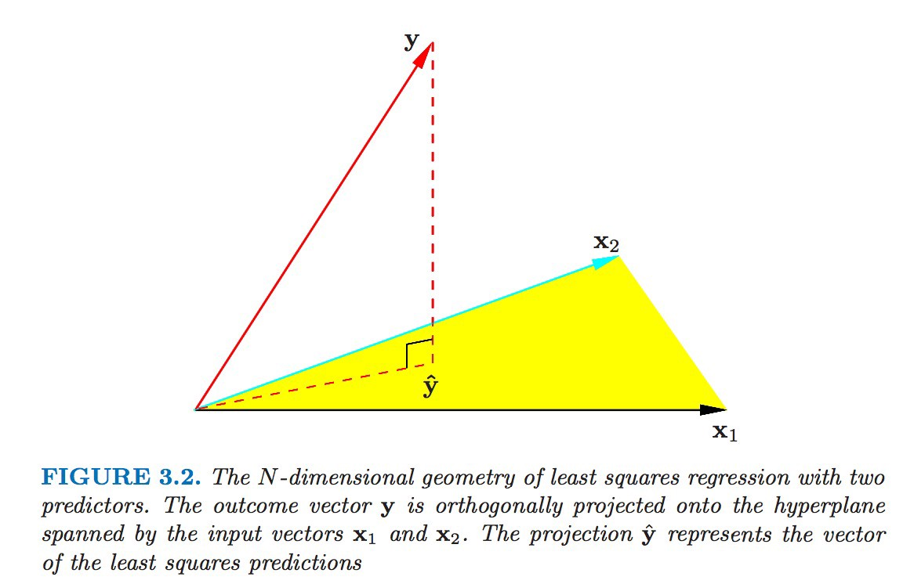

```{r setup, include=FALSE}
knitr::opts_chunk$set(echo = TRUE)
```

# Outline

In this module, we will review linear regression. 

# Linear regression

- Model:
$$
Y_{n \times 1}=X_{n \times p} \beta_{p \times 1}+\epsilon_{n \times 1}
$$
- Equivalently:
$$
y_{i}=x_{i}^{\mathrm{T}} \beta+\epsilon_{i}, \quad i=1, \ldots, n
$$

\pause

- Standard assumptions
  - $y_{i}$ independent (equivalently $\epsilon_{i}$ independent)
  - $\mathbb{E}\left(\epsilon_{i}\right)=0$
  - $\operatorname{var}\left(\epsilon_{i}\right)=\sigma^{2}$, constant
  - $x_{i}$ known, $\beta$ to be estimated

\pause

- More concisely:
$$
\mathbb{E}(Y \mid X)=X \beta, \quad \operatorname{var}(Y \mid X)=\sigma^{2} I
$$

# Interpretation of $\beta_j$

- Effect on the expected response of a unit change in jth explanatory variable, all other variables held fixed

# Least squares estimation

- Definition (minimize the residuals)
$$
\hat{\beta}_{\mathrm{LS}}:=\min _{\beta} \sum_{i=1}^{n}\left(y_{i}-x_{i}^{\mathrm{T}} \beta\right)^{2}
$$
- Equivalently,
$$
\hat{\beta}_{L S}:=\min _{\beta}(y-X \beta)^{\mathrm{T}}(y-X \beta)
$$
- Equivalently (L2 distance),
$$
\hat{\beta}_{\mathrm{LS}}:=\min _{\beta}\|\mathrm{y}-X \beta\|_{2}^{2}
$$

- Equivalently, $\hat{\beta}$ is the solution of the score equation
$$
X^{\mathrm{T}}(y-X \beta)=0
$$

- Solution
$$
\hat{\beta}_{\mathrm{LS}}=\left(X^{\mathrm{T}} X\right)^{-1}\left(X^{\mathrm{T}} \boldsymbol{y}\right)
$$

# Another interpretation: the projection of $Y$ onto the linear subspace spanned by the columns of $\mathbf{X}$


Elements of Statistical Learning, p46

# Least squares estimation (cont'd)

Assume $X$ is fixed, 

- Expected value 

$$\mathbb{E}\left(\hat{\beta}_{\mathrm{LS}}\right)=\left(X^{\mathrm{T}} X\right)^{-1} X^{\mathrm{T}} \mathbb{E}(y)=\left(X^{\mathrm{T}} X\right)^{-1}\left(X^{\mathrm{T}} X\right) \beta=\beta$$

- Variance
$$
\begin{aligned}
\operatorname{var}\left(\hat{\beta}_{L S}\right) &=\left(X^{\mathrm{T}} X\right)^{-1} X^{\mathrm{T}} \operatorname{var}(y) X\left(X^{\mathrm{T}} X\right)^{-1} \\
&=\left(X^{\mathrm{T}} X\right)^{-1} X^{\mathrm{T}} \sigma^{2} I X\left(X^{\mathrm{T}} X\right)^{-1} \\
&=\sigma^{2}\left(X^{\mathrm{T}} X\right)^{-1}
\end{aligned}
$$

# Assumptions for ordinary least squares

- **Linearity**: the expectation of $Y$ is linear in $X_{1} \ldots X_{p}$
- **Independence**: the $\epsilon_{i}$ are independent
- **Mean zero errors**: the $\epsilon_{i}$ have mean zero, i.e. $E\left[\epsilon_{i}\right]=0$
- **Equal variance (homoscedasticity)**: the $\epsilon_{i}$ have the same variance, i.e. $\operatorname{Var}\left[\epsilon_{i}\right]=\sigma^{2}$


# What about normal distribution?

- If we further assume $\epsilon_{i} \sim N\left(0, \sigma^{2}\right)$ (and independent across $i$), then

- $y \mid X \sim N\left(X \beta, \sigma^{2} I\right)$, and
- likelihood function is
$$
L\left(\beta, \sigma^{2} ; y\right)=\frac{1}{\left(2 \pi \sigma^{2}\right)^{n / 2}} \exp \left\{-\frac{1}{2 \sigma^{2}}(y-X \beta)^{T}(y-X \beta)\right\}
$$
- log-likelihood function is
$$
\ell\left(\beta, \sigma^{2} ; y\right)=-\frac{n}{2} \log \left(\sigma^{2}\right)-\frac{1}{2 \sigma^{2}}(y-X \beta)^{\mathrm{T}}(y-X \beta)
$$
- maximum likelihood estimate of $\beta$ is
$$
\hat{\beta}_{M L}=\left(X^{\mathrm{T}} X\right)^{-1} X^{\mathrm{T}} \boldsymbol{y}=\hat{\beta}_{\mathrm{LS}}
$$

# What about normal distribution? (cont'd)

- distribution of $\hat{\beta}$ is normal
$$
\hat{\beta} \sim N_{p}\left(\beta, \sigma^{2}\left(X^{\mathrm{T}} X\right)^{-1}\right)
$$
- distribution of $\hat{\beta}_{j}$ is
$$
N\left(\beta_{j}, \sigma^{2}\left(X^{\mathrm{T}} X\right)_{j j}^{-1}\right), \quad j=1, \ldots, p
$$
- maximum likelihood estimate of $\sigma^{2}$ is 
$$\frac{1}{n}(y-X \hat{\beta})^{\mathrm{T}}(y-X \hat{\beta})$$
- but we use
$$
\tilde{\sigma}^{2}=\frac{1}{n-p}(y-X \hat{\beta})^{\mathrm{T}}(y-X \hat{\beta})
$$


# Maximum likelihood estiamtion vs. OLS

- We did not place any distributional assumptions on the outcome,
  - We only required that $E\left[\epsilon_{i}\right]=0$ with constant variance
  - In other words, OLS is a semiparametric method
  
\pause

- Sometimes, people assume that $\epsilon_{i} \sim N\left(0, \sigma^{2}\right)$, which means
$$
Y_{i} \sim N\left(\beta_{0}+\beta_{1} X_{i 1}+\ldots+\beta_{1} X_{i p}, \sigma^{2}\right)
$$

  - If this additional assumption is made, then we can instead use maximum likelihood estimation for $\boldsymbol{\beta}$
  - This connects to a whole other class of models called generalized linear models (GLMs)
  - Interestingly, in this case, you will end up with the same estimates for $\boldsymbol{\beta}$


# Resources

This tutorial is based on 

- Nancy Reid's STA2101 Methods of Applied Statistics [[links](https://utstat.toronto.edu/reid/sta2101f/sep15-annotated.pdf)]

- Harvard's Biostatistics Preparatory Course Methods  [[links](https://isabelfulcher.github.io/methodsprep/slides/Lecture_5/2018_Lecture_05.pdf)].


