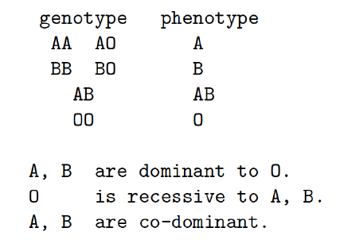

# Part 1: Probability distributions

\begin{enumerate}
\item A contestant on a game show needs to answer 10 questions correctly to win the jackpot. However, if they get 4 incorrect answers, they are kicked off the show. Suppose one contestant consistently has a 80\% chance of correctly responding to any question. 

\begin{enumerate}
\item What is the probability distribution?
\item What is the probability that she will correctly answer 10 questions before 4 incorrect responses? 
\item Write out the R code to calculate (b).
\end{enumerate}

\item A small town’s police department issues 5 speeding tickets per month on average. 

\begin{enumerate}
\item Using a Poisson random variable, what is the likelihood that the police department issues 3 or fewer tickets in one month? 
\item What is the probability that 10 days or fewer elapse between two tickets being issued?
\item Write out the R code to calculate (a), (b).
\end{enumerate}

\end{enumerate}

# Part 2: Statistical inference

\begin{enumerate}
\item (AoS 6.6.2) Let $X_{1}, \ldots, X_{n} \sim \operatorname{Uniform}(0, \theta)$ and let $\hat{\theta}=\max \left\{X_{1}, \ldots, X_{n}\right\}$. Find the bias, se and MSE of this estimator.

\item (AoS 6.6.3) Let $X_{1}, \ldots, X_{n} \sim \operatorname{Uniform}(0, \theta)$ and let $\hat{\theta}=2 \bar{X}_{n}$. Find the bias, se and MSE of this estimator.

\item Let $X_{1}, \ldots, X_{n} \sim \operatorname{Uniform}(0,1)$. Let $Y_{n}=\bar{X}_{n}^{2}$. Find the limiting distribution of $Y_{n}$. (Hint: CLT)

\end{enumerate}

# Part 3: EM and Newton-Raphson implementation

The $\mathrm{ABO}$-gene or $\mathrm{ABO}$-locus is on chromosome 9. It has 3 alleles (antigens) $(A, B, O$) and it determines 4 blood type $(A, B, A B, O)$.

{width=30% }

We have a large random sample obtained from Berlin (Bernstein 1925, Sham's book page 44):

- $n_{A}=9123$ blood type $A$
- $n_{B}=2987$ blood type $B$
- $n_{A B}=1269$ blood type $A B$
- $n_{O}=7725$ blood type O

For instance, $n_{A}=9123=n_{A A}+n_{A O}:$ Among 9123 blood type $A$ individuals, some have genotype $A A$ and the others have genotype $A O$. 

Our interest is to estimate the allele frequencies of alleles A, B, and O. i.e. $p=$ freq $($allele $A)$, $q=$ freq $($allele $B)$, $1-p-q=$ freq $($allele $O)$.

1. Write out the log-likelihood $L(p,q)$.

2. Is there a closed-form solution of this log-likelihood function?

3. Formulate the problem as a missing data problem and use the Newton-Raphson algorithm to find the MLEs, $\hat{p}$ and $\hat{q}$, that maximize the log-likelihood, $\ln L(p, q)$.
