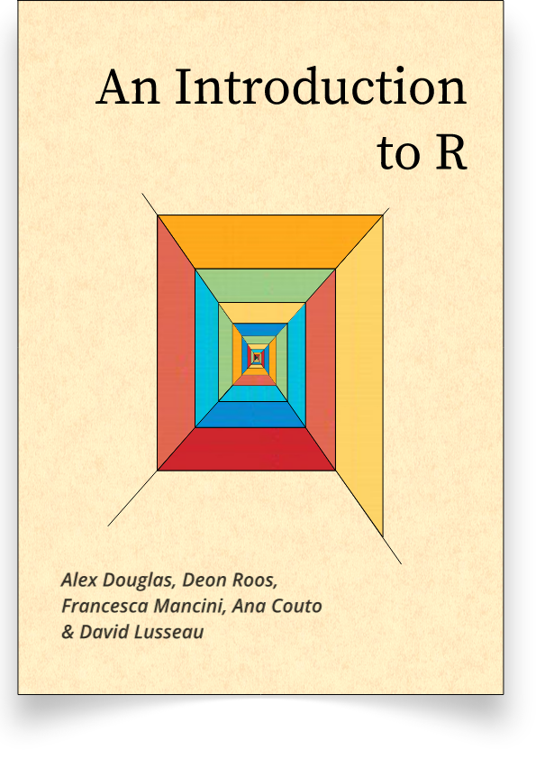

# Module 0: Basic R programming

This module contains information related to how to write R code and use R Studio.

In particular, this module covers:

- Rstudio (Knitr)
- Basic data types
- Basic data structures
- Functions
- For loops

Useful resources:

- [Tidyverse style guide](https://style.tidyverse.org/index.html)
- [The R Inferno](https://www.burns-stat.com/pages/Tutor/R_inferno.pdf)

# Introduction to R and Rstudio

R is a free statistical software.  We use R frequently/intensively during our study.

First please download R and the IDE Rstudio (if you haven't).

- https://www.r-project.org/
- https://www.rstudio.com/

# Studio

- Editor: edit or save the file.
- Console: outputs.
- Values: store values of assigned.
- Files/plots/packages/help.
  
{height=60%}

# How to set working directory? 

Working directory is important since you might want to read and import data from other files.  It is recommended to put these files under the same directory with your scripts. 

- Method 1: Session -> set working directory.            
- Method 2: Files -> Navigate to your directory.
- Method 3: `setwd()`.

Alternative: 
- Make an Project
- Files -> New Project;
- This will create an .Rproj file

# How to install packages? 

Common packages in statistical analysis with R:

- tidyverse/dpylr
- ggplot
- kableExtra or gridExtra

Several options to install packages:

- Method 1: Tools -> install packages
- Method 2: Packages window. 
- **Method 3:** `install.packages()`
- Method 4: `devtools::install_github()` (install `devtools` first with `install.packages("devtools")` if you haven't already)
- Method 5: `pak::pkg_install()` (install `pak` first with `install.packages("pak")` if you haven't already)

Use Method 4 if you want to use a package on github. Use Method 5 if you are encountering dependency issues.

# Ready with your Rstudio?

Let's code! 

# Vectors 

Can contain numerical, string, or Boolean values. 

Store data = make an assignment.  `c()` is for component. 

```{r}
v <- c(TRUE, FALSE, TRUE, TRUE, FALSE)
v <- c("python", "mathlab", "R") 
v <- c(6, 5, 4, 3, 2, 1)
```

Are you familiar with the output of these?

```{r}
which(v == 3)
```

```{r, eval = F}
v[2]
v[-2]
v[2:3]
v[v < 4]
which(v == 3)
```

# Matrix

```{r, eval = F}
mymat <- matrix(c(1:10), nrow = 2, ncol = 5, 
                byrow = TRUE)
mymat
mymat[1, 5]
mymat[2, ]
mymat[c(1:2), c(1:2)]
```

# Data frame

```{r}
studentID <- c(1, 2, 3, 4)
age <- c(17, 18, 16, 19)
gender <-c("M", "F", "M", "M")
studentData <- data.frame(studentID, age, gender)
```

```{r}
rownames(studentData) <- c("A", "B", "C", "D")
```

```{r}
colnames(studentData) <- c("ID", "age", "gender")
studentData
```

# Linear Regression

$y_i = \beta^T x_i + \epsilon_i$

```{r}
x <- c(1:5)
eps <- rnorm(5)
y <- 2*x + eps
mod <- lm(y ~ x)
```

# Linear Regression

\footnotesize
```{r}
summary(mod)
```

# List

```{r}
g <- "My List"
h <- c(2, 3, 5, 7)
j <- matrix(1:10, nrow = 5, byrow = FALSE)
k <- c("one", "two", "three")
mylist <- list(title = g, ages = h, j, k)
```

```{r}
mylist[[2]]
```

```{r}
mylist$ages
mylist[[1]] 
```

# Plotting 

\tiny

```{r, out.width = "80%"}
y <- c(5, 4, 2, 3, 1) 
x <- c(1, 2, 3, 4, 5)
plot(x, y, type = "l")
```

# Other

\footnotesize

Important for stats research. 

- `floor(v)`, `ceiling(v)`
- `round(v, 2)`
- `rnorm()`, `rexp()`, `rbinom()`, etc generate random variables 
- Functions
 
```{r}
rnorm(5, mean = 0, sd = 1) # 5 random numbers from N(0, 1)
```
 
```{r}
round(2.333333, 2)
```

```{r}
func <- function(x1, x2) {
   y <- 3 * x1^2 + 3 * x2^2 - 2* x1^2 *x2
   return(y)
}
func(1, 2)
```

# If else

What is the output?

```{r, eval = F}
p <- 3
if (p <= 2) {
  print("p <= 2!")
} else {
  print("p > 2!")
}
```

# for loop

```{r}
v <- c(1, 2, 4, 3) 
w <- c(0, 0, 0, 0) 
t <- 0

for (i in v) {
  t <- t + 1
  w[t] <- w[t] + i 
  print(w)
}

w
```

# while loop

```{r}
i <- 1
while (i <= 10) {
  print(i)
  i <- i + 1
}
```

# next 

```{r}
alphabet <- LETTERS[1:6] 
for (i in alphabet) {
  if(i == 'D') {
    next 
  }
 print(i) 
}
```

# break

```{r}
alphabet <- LETTERS[7:12] 
for (i in alphabet) {
  if (i == 'K') {
    break 
  }
  print(i) 
}
```

# apply

 It can be applied on matrix, vector, data frame, and loop through row or column (defined by the second input - `MARGIN`). 

Syntax: `apply(X, MARGIN, FUN, ...)`

\tiny
```{r}
f <- function(x) {
  ts <- 2*x^2
  return(ts)
}

ii <- matrix(1:4, nrow = 1)
apply(ii, 1, f)
```

# Knit in Rstudio 

Common types of R files: `.R`, `.Rmd`, `.qmd`

- Simulations, e.g. for loops, functions, I use `.R`
- Reporting, analysis, plotting, I use `.Rmd` or `.qmd`

.Rmd/.qmd files can be converted to pdf, html through `knitr`. 

- yaml style. 

```{r, eval = F}
---
title: 'Module 1: Basic programming in R'
date: "04/15/2022"
output:
  beamer_presentation
---
```

# More yaml style 

```{r, eval = F}
---
title: "A summary of xx"
date: "02/14/2022"
output: 
  pdf_document:
    toc: true
    number_sections: true
---
```

# LaTeX and Markdown

LaTeX is useful for documents with mathematical formulas. 

- [Overleaf](www.overleaf.com) - an online, collaborative LaTeX editor 
- LaTeX mathematical symbols
- Inline equation e.g. (`$\alpha$`) returns $\alpha$
- Equation e.g. (`$$e = mc^2$$`) returns $$e = mc^2$$

Markdown is appealing for formatting, e.g. headings, bold text, text with codes, ...


# Markdown

```md
# This is a Major Section

## This is a Sub-Section

### This is a Sub-Sub-Section
```

*Italics*
```md
*Italics*

```
**Bold Text**

```md
**Bold Text**
```

# Markdown

Code blocks:


```{r}
print("run R code!")
```

# Resources


- "R Markdown Cookbook" by Yihui Xie. 
  - https://bookdown.org/yihui/rmarkdown-cookbook/
- "Getting Started with R Markdown" by Coding Club
  - https://ourcodingclub.github.io/tutorials/rmarkdown/
- "An Introduction to R" by Alex Douglas, Deon Roos, Francesca Mancini, Ana Couto & David Lusseau
  - https://intro2r.com/
  

{height=50%}{height=50%}