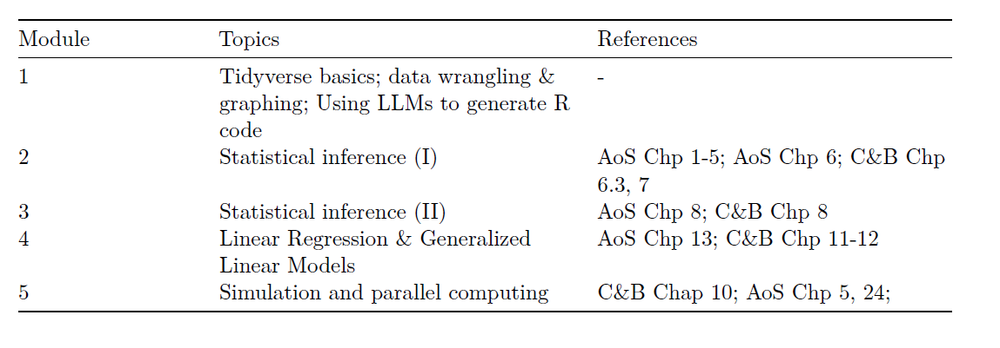
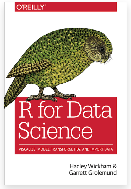

```{r setup, include=FALSE}
knitr::opts_chunk$set(echo = TRUE)
```

# Methods and computing camp

This summer we will together learn and review materials of statistical computing and methods. 


# What do we do during lectures?

Materials will be available at course website.  Lecture notes are created by Rmarkdown.  

- **If you have questions, feel free to interrupt or send a message in the chat.**

We will cover 5 modules of statistical methods and computing.  

- Each module takes ~1.75 hours.

# What contents we will cover?



# What contents we will not cover?

- Nonparametric inference (STA3000) 
- Bayesian inference (STA3000, STA2201)
- Computing of Bayesian inference (STA2201)
- Shiny and blogdown in R

# Exercises!

- Available for each module. 
- Exercises can be difficult. 
- Group discussion is recommended. 

# Prerequisites: 

<!--
Add URL
--->
- Students are expected to have some basic experience with R, Rmarkdown and LaTeX.
- See [Module 0]() for some background

# Code style 

- [Tidyverse style guide](https://style.tidyverse.org/) 
- `styler` software embedded in Rstudio - allows you to interactively restyle selected text, files, or entire projects.
- `lintr` software embedded in Rstudio - performs automated checks to confirm that you conform to the style guide. 

# Outline

We will review R, Rstudio, and Syntax of R together. 

- Tidy data, processing (tidyverse)
- Graphing (ggplot2)

# Resources

- "R for Data Science: Import, Tidy, Transform, Visualize, and Model Data" by Hadley Wickham.  
- Brendan R. E. Ansell's "Introduction to R - tidyverse" [[link]](https://bookdown.org/ansellbr/WEHI_tidyR_course_book/) 

{height=50%}

# Data import

\tiny
```{r}
df <- read.table("mtcars.txt", header = TRUE)
head(df) # Show the first 6 rows. 
```

# Other options 

CSV files. 

- base::read.csv() in the base r.
- readr::read.csv() in "readr" package (much faster). 
- data.table::fread() in  "data.table" package (much more faster). 

Rdata. 

- load() in the base r. 

# Tidy data 

The goal is to clean the dataset so it is much easier to use. 

Specifically, 

- Each variable must have its own column.
- Each observation must have its own row. 
- Each value must have its own cell. 

We will focus on the functions from `tidyverse` package. 


```{r message=FALSE, warning=FALSE}
library(tidyverse)
```


# Tidy data 1: pivoting 

For a dataset having column names are not names of variables, but values of a variable, e.g. 

\tiny
```{r}
# table4a documents the number 
# of documented TB cases in 
# Afghanistan, Brazil and China
table4a
```

- Need to change 1999, 2000 to a column? named as "year".
- Need to change the values of 1999, 2000 as "cases". 

We can use `pivot_longer()` from the "tidyverse" package. 

# Pivot longer

\tiny
```{r}
table4a %>% 
  pivot_longer(c(`1999`, `2000`), 
               names_to = "year", values_to = "cases")
```

# Another example 

\tiny
```{r}
table2 %>% head(5)
```

- case and population are two variables and should be converted into columns. 

We can use `pivot_wider()`.

# Pivot wider

\tiny
```{r}
table2 %>%
    pivot_wider(names_from = type, values_from = count)
```

# Transform data

Use the "pipes" from the "tidyverse" package, a powerful tool for clearly expressing a sequence of multiple operations, with the combination of the following functions:

- `select()`
- `filter()`
- `arrange()`
- `mutate()`
- `summarise()`
- `group_by()`

# Dataset - Diamonds

A dataset containing the prices and other attributes of almost 54,000 diamonds. 

\tiny
```{r}
head(diamonds)
```

# Select

Use `select()` to get a column, e.g. "color"

\tiny
```{r}
diamonds %>%
  select(color) %>%
  head()
```

```{r}
# Equivalent to...
head(diamonds$color)
```


# Select

Use `select()` to remove a column, e.g. "color"

\tiny
```{r}
diamonds %>%
  select(-color)
```

```{r, eval = F}
# Need to assign the change to the original dataset, otherwise, the deletion won't affect the dataset.
diagmonds <- diamonds %>%
  select(-color)
```

# Filter 
```{r message=FALSE, warning=FALSE, include=FALSE}
conflicted::conflicts_prefer(dplyr::filter)
```


Use `filter()` to filter by some condition, e.g. filter all price > 335

\tiny
```{r}
diamonds %>%
  filter(price > 335)
```

# Filters with multiple conditions 

\tiny

```{r}
diamonds %>%
  filter(price > 335 & depth < 64)
```

# Filters with multiple conditions 

\tiny

```{r}
diamonds %>%
  filter(cut == "Very Good" | cut == "Fair")
```

# Filter after select

This is an example of "a sequence of operations". 

\tiny
```{r}
diamonds %>%
  select(price) %>%
  filter(price > 335)
```

# Arrange 

Use `arrange()` to order data. 

\tiny
```{r}
diamonds %>%
  arrange(price)
```

# Arrange descending order

e.g. from the cheapest! 

\tiny
```{r}
diamonds %>%
  arrange(-price)
```

# Arrange by multiple conditions 

\tiny
```{r}
diamonds %>%
  arrange(price, cut)
```

# Filter, select, arrange 

\tiny
```{r}
diamonds %>%
  filter(table < 340) %>%
  select(carat, cut, price) %>%
  arrange(price, cut)
```

# Mutate 

Create new variables using `mutate()`.

- Create a boolean variable, 0 = not affordable, 1 = affordable. 

\tiny
```{r}
diamonds %>%
  mutate(affordable = price < 400) 
```

# Mutate (cont'd)

- Create a variable containing string with `case_when()`:

\tiny
```{r}
diamonds %>%
  mutate(affordable = case_when(price<400 ~ "affordable", 
                                TRUE ~ "not affordable")) 
```

# Group by and Summarise

Use `group_by` and `summarise` to group variables:

\tiny
```{r}
diamonds %>%
  group_by(cut) %>%
  summarise(n = n())
```

# More examples

\tiny
```{r}
diamonds %>%
  group_by(cut) %>%
  summarise(n = n(), price_avg = mean(price))
```

# Proportions 

\tiny
```{r}
diamonds %>%
  group_by(cut) %>%
  summarise(n = n(), price_avg = mean(price)) %>%
  ungroup() %>%
  mutate(prop = n/sum(n))
```

# With percentage

Use `scales::percent()` to add `%`.

\tiny
```{r message=FALSE, warning=FALSE}
diamonds %>%
  group_by(cut) %>%
  summarise(n = n(), price_avg = mean(price)) %>%
  ungroup() %>%
  mutate(prop = scales::percent(n/sum(n)))
```

# Graphing after transformation

\tiny
```{r fig.height=2, fig.width=4, message=FALSE, warning=FALSE}
diamonds %>%
  group_by(cut) %>%
  summarise(n = n(), price_avg = mean(price)) %>%
  ggplot() +
  geom_bar(aes(x = cut, y = n), stat = "identity")
```

# ggplot

Here we used functions from "ggplot2" package. Same pattern as "tidyverse", but using "+" to connect. 

How to write? 

- Specify the data using `ggplot(data = diamonds)`
- Specify the x-/y-axis, `ggplot(data = diamonds, mapping = aes(x = cut))`
- Specify the types of plots with `geom`, e.g. `+ geom_bar()`

```{r eval=F, message=FALSE, warning=FALSE}
ggplot(data = diamonds) +
  geom_bar(mapping = aes(x = cut))
```

# More plots

- `geom_histogram()`, `geom_density()`, `geom_line()`, `geom_point()`
- `geom_facet()` generates subplots 
- color package 
  - `RColorBrewer`
  - `ggsci`
- formatting package
  - `ggthemes`

# Break


# Install and load package

From what we have learned so far, how to install package? What packages are we going to use? 

\pause

```{r, eval = F}
install.packages("palmerpenguins")
```

```{r message=FALSE, warning=FALSE}
library(tidyverse)
library(palmerpenguins)
```


# Skim the data

How many observations? How many variables? What type? 

\pause

\tiny
```{r}
glimpse(penguins)
```

# Scatter plot 

Consider a scatter plot of flipper length and body mass for `species = "Adelie"`

First let's prepare the data to plot (Hint: filter). 

\pause

```{r}
pdata <- penguins %>%
  filter(species == "Adelie")
```

# A blank canvas

`aes` stands for aesthetic and tells ggplot the main characteristics of your plot (x, y, and if the color or fill vary by group)

\tiny
```{r fig.align="center", message=FALSE, warning=FALSE, out.height='60%'}
ggplot(data = pdata, aes(x = flipper_length_mm, y = body_mass_g))
```

# Add the points 

Add layers with ggplot using the `+`

\tiny
```{r fig.align="center", message=FALSE, warning=FALSE, out.height='60%'}
ggplot(data = pdata, aes(x = flipper_length_mm, y = body_mass_g)) +
  geom_point()
```

# Tidy up labels

\tiny
```{r fig.align="center", message=FALSE, warning=FALSE, out.height='60%'}
ggplot(data = pdata, aes(x = flipper_length_mm, y = body_mass_g)) +
  geom_point() + 
  xlab("Flipper length (mm)") +
  ylab("Body mass (g)")
```


# Add a title

\tiny
```{r fig.align="center", message=FALSE, warning=FALSE, out.height='60%'}
ggplot(data = pdata, aes(x = flipper_length_mm, y = body_mass_g)) +
  geom_point() + 
  xlab("Flipper length (mm)") +
  ylab("Body mass (g)") +
  labs(title = "Penguin size, Palmer Station LTER")
```

# Subtitle

\tiny
```{r fig.align="center", message=FALSE, warning=FALSE, out.height='60%'}
ggplot(data = pdata, aes(x = flipper_length_mm, y = body_mass_g)) +
  geom_point() + 
  xlab("Flipper length (mm)") +
  ylab("Body mass (g)") +
  labs(title = "Penguin size, Palmer Station LTER",
       subtitle = "Flipper length and body mass for Adelie")
```


# Change color of points

To see all colors, type `colors()`

\tiny
```{r fig.align="center", message=FALSE, warning=FALSE, out.height='60%'}
ggplot(data = pdata, aes(x = flipper_length_mm, y = body_mass_g)) +
  geom_point(color = "darkorange") + 
  xlab("Flipper length (mm)") +
  ylab("Body mass (g)") +
  labs(title = "Penguin size, Palmer Station LTER",
       subtitle = "Flipper length and body mass for Adelie")
```

# Size of points 

\tiny
```{r fig.align="center", message=FALSE, warning=FALSE, out.height='60%'}
ggplot(data = pdata, aes(x = flipper_length_mm, y = body_mass_g)) +
  geom_point(color = "darkorange",
             size = 3, 
             alpha = 0.8) + 
  xlab("Flipper length (mm)") +
  ylab("Body mass (g)") +
  labs(title = "Penguin size, Palmer Station LTER",
       subtitle = "Flipper length and body mass for Adelie")
```

# Coloring by group 

Now use the whole data `penguins`. Specifying the color in `aes()` because it **depends on the data**.

\tiny
```{r fig.align="center", message=FALSE, warning=FALSE, out.height='60%'}
ggplot(data = penguins, aes(x = flipper_length_mm, y = body_mass_g, color = species)) +
  geom_point(size = 3, alpha = 0.8) + 
  xlab("Flipper length (mm)") +
  ylab("Body mass (g)") +
  labs(title = "Penguin size, Palmer Station LTER",
       subtitle = "Flipper length and body mass for Adelie")
```

# Change the color manually by group 

Specifying the color in `aes()` because it **depends on the data**.

\tiny
```{r fig.align="center", message=FALSE, warning=FALSE, out.height='60%'}
ggplot(data = penguins, aes(x = flipper_length_mm, y = body_mass_g, color = species)) +
  geom_point(size = 3, alpha = 0.8) +
  scale_color_manual(values = c("darkorange","purple","cyan4")) + 
  xlab("Flipper length (mm)") +
  ylab("Body mass (g)") +
  labs(title = "Penguin size, Palmer Station LTER",
       subtitle = "Flipper length and body mass for Adelie")
```

# Change the theme

\tiny
```{r fig.align="center", message=FALSE, warning=FALSE, out.height='60%'}
ggplot(data = penguins, aes(x = flipper_length_mm, y = body_mass_g, color = species)) +
  geom_point(size = 3, alpha = 0.8) +
  scale_color_manual(values = c("darkorange","purple","cyan4")) + 
  xlab("Flipper length (mm)") +
  ylab("Body mass (g)") +
  labs(title = "Penguin size, Palmer Station LTER",
       subtitle = "Flipper length and body mass for Adelie") +
  theme_bw()
```

# Change the color scheme

Optional: try `ggsci` functions.

\tiny
```{r fig.align="center", message=FALSE, warning=FALSE, out.height='60%'}
ggplot(data = penguins, aes(x = flipper_length_mm, y = body_mass_g, color = species)) +
  geom_point(size = 3, alpha = 0.8) +
  xlab("Flipper length (mm)") +
  ylab("Body mass (g)") +
  labs(title = "Penguin size, Palmer Station LTER",
       subtitle = "Flipper length and body mass for Adelie") +
  theme_bw() +
  scale_color_viridis_d()
```

# Other plot types?

Other types are also available, e.g. histograms, bar charts, box plots, line graphs and scatter plots. 

# Histograms

\tiny
```{r fig.align="center", message=FALSE, warning=FALSE, out.height='60%'}
ggplot(data = penguins, aes(x = flipper_length_mm, fill = species)) +
  geom_histogram(alpha = 0.8) +
  scale_fill_manual(values = c("darkorange","purple","cyan4")) +
  xlab("Flipper length (mm)") +
  ylab("Frequency") +
  labs(title = "Penguin flipper lengths") +
  theme_bw() 
```

# Histogram

Try `binwidth = ` and `bins == `

\tiny
```{r fig.align="center", message=FALSE, warning=FALSE, out.height='60%'}
ggplot(data = penguins, aes(x = flipper_length_mm, fill = species)) +
  geom_histogram(binwidth = 1, alpha = 0.8) +
  scale_fill_manual(values = c("darkorange","purple","cyan4")) +
  xlab("Flipper length (mm)") +
  ylab("Frequency") +
  labs(title = "Penguin flipper lengths") +
  theme_bw() 
```

# Boxplots

\tiny
```{r fig.align="center", message=FALSE, warning=FALSE, out.height='60%'}
ggplot(data = penguins, aes(x = species, y = flipper_length_mm)) +
  geom_boxplot(show.legend = FALSE) +
  xlab("Flipper length (mm)") +
  ylab("Frequency") +
  labs(title = "Penguin flipper lengths") +
  theme_bw() 
```

# Barcharts 

First, try to summarize the penguin data by species and returns the proportion of each penguin types. 

\pause

\tiny
```{r}
gplot <- penguins %>% 
  group_by(species) %>% 
  tally() %>% 
  mutate(prop = n / sum(n))
gplot
```
# Barcharts 

\tiny
```{r fig.align="center", message=FALSE, warning=FALSE, out.height='60%'}
ggplot(data = gplot, aes(x = species, y = prop))  + 
  geom_bar(stat = "identity") + 
  xlab("Species") +
  ylab("Proportions") +
  labs(title = "Penguin species") +
  theme_bw() 
```

# Faceting

\tiny
```{r fig.align="center", message=FALSE, warning=FALSE, out.height='60%'}
ggplot(penguins, aes(x = flipper_length_mm, y = body_mass_g)) +
  geom_point(aes(color = sex)) +
  scale_color_manual(values = c("darkorange","cyan4"), na.translate = FALSE) +
  labs(title = "Penguin flipper and body mass",
       subtitle = "Dimensions for male and female Adelie, Chinstrap and Gentoo Penguins at Palmer Station LTER",
       x = "Flipper length (mm)",
       y = "Body mass (g)",
       color = "Penguin sex") +
  facet_wrap(~species)
```

# Using LLMs for writing R code


# Popular LLMs

## Online LLMs

- [ChatGPT](https://chatgpt.com/) *
- [Claude](https://claude.ai/new)
- [Gemeni](https://gemini.google.com/) *
- [Grok](https://grok.com/)
- [DeepSeek](https://www.deepseek.com/)

($*$: My preferred choices)

## Local LLMs

- [Ollama](https://ollama.com/)
  - Open source LLMs. 
  - Performance depends on the model choice and your machine
  - Secure, but generally not as good as Online LLMs


# Important Tips

- Never provide sensitive data to an LLM
- Do not accept LLM responses for absolute truth (they still make mistakes and overcomplicate!)
- YOU are fully responsible for the accuracy, originality, licensing, and ethical/legal compliance of work that you do.
  - Failure to provide a complete and accurate disclosure of AI usage may be considered an ethical breach in research/work contexts.

# Example - Pivot Data

\tiny

**Prompt**

```
I have a wide dataset (called table4a) with the "country" column 
as the id variable and columns named "1999" and "2000" that provide 
the number of TB cases in each country for that year. 

Provide R code that will convert 
this wide dataset to long form 
```

```{r}
library(tidyr)

table4a_long <- table4a|> 
  pivot_longer(
    cols = c(`1999`, `2000`),
    names_to = "year",
    values_to = "cases"
  )

table4a_long
```

# Example - Improve Visualizations

**Before**

```{r echo=FALSE, message=FALSE, warning=FALSE, out.height="70%"}
ggplot(penguins, aes(x = flipper_length_mm, y = body_mass_g)) +
  geom_point(aes(color = sex)) +
  scale_color_manual(values = c("darkorange","cyan4"), na.translate = FALSE) +
  labs(
    title = "Penguin flipper and body mass",
    x = "Flipper length (mm)",
    y = "Body mass (g)",
    color = "Penguin sex"
  ) +
  facet_wrap(~species)
```


# Example - Improve Visualizations

**After**
\tiny
**Prompt:**

```
I have the following R code:
<PASTE R CODE HERE>

Please update the code so that the rendered visual is publication ready
```

```{r echo=FALSE, message=FALSE, warning=FALSE, out.height="70%"}
ggplot(penguins,aes(x = flipper_length_mm, y = body_mass_g)) +
  geom_point(aes(color = sex), size = 2.4, alpha = 0.8, na.rm = TRUE) +
  scale_color_manual(values = c("female" = "#D55E00", "male"   = "#0072B2"), na.translate = FALSE) +
  facet_wrap(~ species, nrow = 1) +
  labs(
    title = "Penguin flipper length and body mass",
    subtitle = "Measurements for male and female Adelie, Chinstrap, and Gentoo penguins at Palmer Station LTER",
    x = "Flipper length (mm)",
    y = "Body mass (g)",
    color = "Sex"
  ) +
  theme_classic(base_size = 12) +
  theme(
    plot.title = element_text(face = "bold", size = 15, margin = margin(b = 6)),
    plot.subtitle = element_text(size = 10.5, color = "gray30", margin = margin(b = 12)),
    axis.title = element_text(face = "bold"),
    axis.text = element_text(
      color = "gray20"
    ),
    strip.background = element_rect(
      fill = "gray90",
      color = NA
    ),
    strip.text = element_text(
      face = "bold",
      size = 11
    ),
    legend.position = "top",
    legend.title = element_text(face = "bold"),
    panel.spacing = unit(1.2, "lines"),
    plot.margin = margin(10, 12, 10, 12)
  )
```

# Exercises

Available on course website. 
