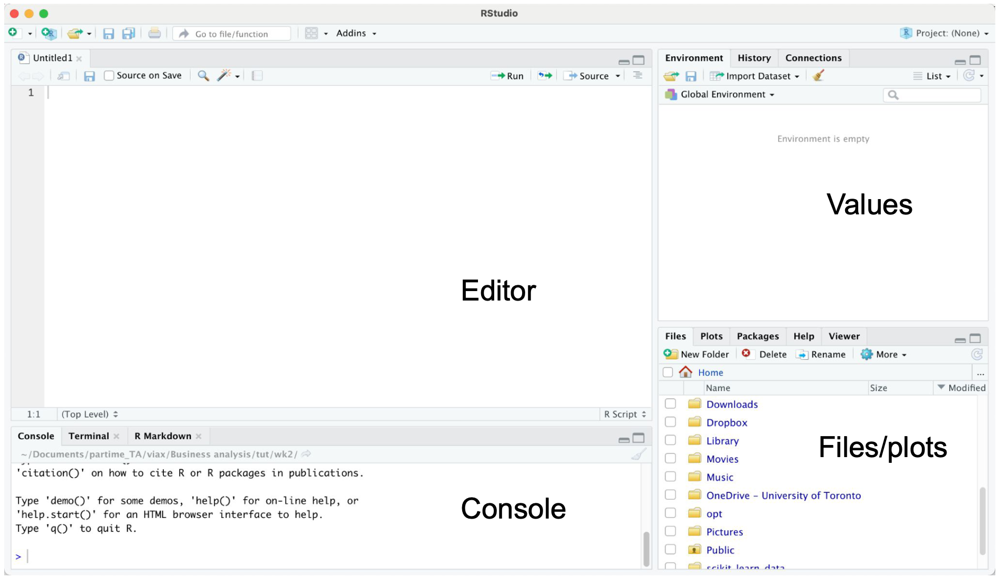
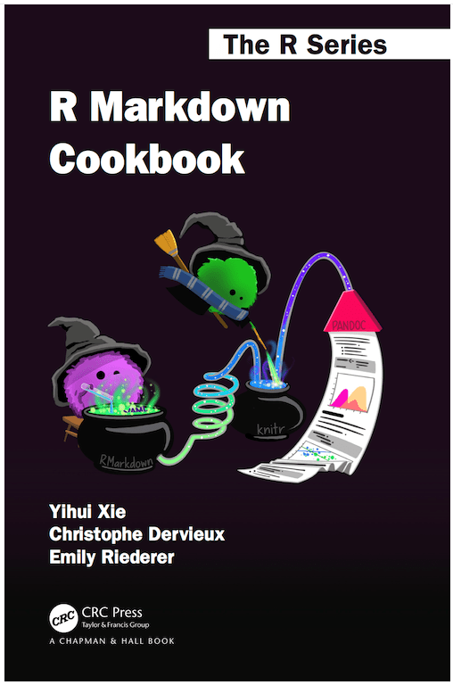
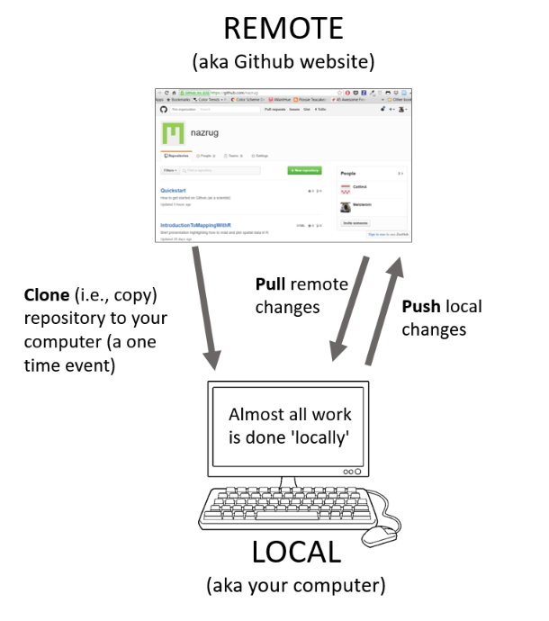

```{r setup, include=FALSE}
knitr::opts_chunk$set(echo = TRUE)
```

# Methods and computing camp

This summer we will together learn and review materials of statistical computing and methods. 


# What do we do during lectures?

Materials will be available at course website.  Lecture notes are created by Rmarkdown.  

- **If you have questions, feel free to interrupt or send a message in the chat.**

We will cover 5 modules of statistical methods and computing.  

- Each module takes ~2.5 hours.

# What contents we will cover?

{height=80%}

# What contents we will not cover?

- Nonparametric inference (STA3000) 
- Bayesian inference (STA3000, STA2201)
- Computing of Bayesian inference (STA2201)
- Shiny and blogdown in R

# Exercises!

- Available for each module. 
- Exercises can be difficult. 
- Group discussion is recommended. 
- Solutions are released during the last 10-20 mins. 

# Module 1: Basic programming in R

We will review R, Rstudio, and Syntax of R together. 

- Rstudio (Knitr)
- Basic data types
- Basic data structures
- Functions
- For loops

Useful resources:

- [Tidyverse style guide](https://style.tidyverse.org/index.html)
- [The R Inferno](https://www.burns-stat.com/pages/Tutor/R_inferno.pdf)

# Introduction to R and Rstudio

R is a free statistical software.  We use R frequently/intensively during our study.

First please download R and its IDE Rstudio (if you haven't).

- https://www.r-project.org/
- https://www.rstudio.com/

# Studio

- Editor: edit or save the file.
- Console: outputs.
- Values: store values of assigned.
- Files/plots/packages/help.
  
{height=60%}

# How to set working directory? 

Working directory is important since you might want to read and import data from other files.  It is recommended to put these files under the same directory with your scripts. 

- Method 1: Session -> set working directory.            
- Method 2: Files -> Navigate to your directory.
- Method 3: `setwd()`.

Alternatives: Set R.project.

# How to install packages? 

Common packages in statistical analysis with R:

- tidyverse/dpylr
- ggplot
- kableExtra or gridExtra

Several options to install packages:

- Method 1: Tools -> install packages
- Method 2: Packages window. 
- **Method 3:** `install.packages()`
- Method 4: `devtools::install_github()`
- Method 5: `pak::pkg_install()`

Use Method 4 if you want to use a package on github. Use Method 5 if you are encountering dependency issues.

# Ready with your Rstudio?

Let's code! 

# Vector 

Can contain numerical, string, or Boolean value. 

Store data = make an assignment.  `c()` is for component. 

```{r}
v <- c(TRUE, FALSE, TRUE, TRUE, FALSE)
v <- c("python", "mathlab", "R") 
v <- c(6, 5, 4, 3, 2, 1)
```

Are you familiar with the output of these?

```{r}
which(v == 3)
```

```{r, eval = F}
v[2]
v[-2]
v[2:3]
v[v < 4]
which(v == 3)
```

# Matrix

```{r, eval = F}
mymat <- matrix(c(1:10), nrow = 2, ncol = 5, 
                byrow = TRUE)
mymat
mymat[1, 5]
mymat[2, ]
mymat[c(1:2), c(1:2)]
```

# Data frame

```{r}
studentID <- c(1, 2, 3, 4)
age <- c(17, 18, 16, 19)
gender <-c("M", "F", "M", "M")
studentData <- data.frame(studentID, age, gender)
```

```{r}
rownames(studentData) <- c("A", "B", "C", "D")
```

```{r}
colnames(studentData) <- c("ID", "age", "gender")
studentData
```

# Linear Regression

$y_i = \beta^T x_i + \epsilon_i$

```{r}
x <- c(1:5)
eps <- rnorm(5)
y <- 2*x + eps
mod <- lm(y ~ x)
```

# Linear Regression

\footnotesize
```{r}
summary(mod)
```

# List

```{r}
g <- "My List"
h <- c(2, 3, 5, 7)
j <- matrix(1:10, nrow = 5, byrow = FALSE)
k <- c("one", "two", "three")
mylist <- list(title = g, ages = h, j, k)
```

```{r}
mylist[[2]]
```

```{r}
mylist$ages
mylist[[1]] 
```

# Plotting 

\tiny

```{r, out.width = "80%"}
y <- c(5, 4, 2, 3, 1) 
x <- c(1, 2, 3, 4, 5)
plot(x, y, type = "l")
```

# Other

\footnotesize

Important for stats research. 

- `floor(v)`, `ceiling(v)`
- `round(v, 2)`
- `rnorm()`, `rexp()`, `rbinom()`, etc generate random variables 
- Functions
 
```{r}
rnorm(5, mean = 0, sd = 1) # 5 random numbers from N(0, 1)
```
 
```{r}
round(2.333333, 2)
```

```{r}
func <- function(x1, x2) {
   y <- 3 * x1^2 + 3 * x2^2 - 2* x1^2 *x2
   return(y)
}
func(1, 2)
```

# If else

What is the output?

```{r, eval = F}
p <- 3
if (p <= 2) {
  print("p <= 2!")
} else {
  print("p > 2!")
}
```

# for loop

```{r}
v <- c(1, 2, 4, 3) 
w <- c(0, 0, 0, 0) 
t <- 0

for (i in v) {
  t <- t + 1
  w[t] <- w[t] + i 
  print(w)
}

w
```

# while loop

```{r}
i <- 1
while (i <= 10) {
  print(i)
  i <- i + 1
}
```

# next 

```{r}
alphabet <- LETTERS[1:6] 
for (i in alphabet) {
  if(i == 'D') {
    next 
  }
 print(i) 
}
```

# break

```{r}
alphabet <- LETTERS[7:12] 
for (i in alphabet) {
  if (i == 'K') {
    break 
  }
  print(i) 
}
```

# apply

 It can be applied on matrix, vector, data frame, and loop through row or column (defined by the second input - `MARGIN`). 

Syntax: `apply(X, MARGIN, FUN, ...)`

\tiny
```{r}
f <- function(x) {
  ts <- 2*x^2
  return(ts)
}

ii <- matrix(1:4, nrow = 1)
apply(ii, 1, f)
```

# Knit in Rstudio 

Common types of R files: `.R`, `.Rmd`, `.qmd`

- Simulations, e.g. for loops, functions, I use `.R`
- Reporting, analysis, plotting, I use `.Rmd` or `.qmd`

.Rmd/.qmd files can be converted to pdf, html through `knitr`. 

- yaml style. 

```{r, eval = F}
---
title: 'Module 1: Basic programming in R'
date: "04/15/2022"
output:
  beamer_presentation
---
```

# More yaml style 

```{r, eval = F}
---
title: "A summary of xx"
date: "02/14/2022"
output: 
  pdf_document:
    toc: true
    number_sections: true
---
```

# Resources

- "R Markdown Cookbook" by Yihui Xie. 
  - https://bookdown.org/yihui/rmarkdown-cookbook/
- "R for Data Science (2e)" by Hadley Wickham
  - https://r4ds.hadley.nz/quarto.html

{height=50%} {height=50%}


# Code style 

- [Tidyverse style guide](https://style.tidyverse.org/) 
- `styler` software embedded in Rstudio - allows you to interactively restyle selected text, files, or entire projects.
- `lintr` software embedded in Rstudio - performs automated checks to confirm that you conform to the style guide. 

# Break


# Outline

We will review R, Rstudio, and Syntax of R together. 

- LaTeX/Markdown
- Tidy data, processing (tidyverse)
- Graphing (ggplot2)

# LaTeX and Markdown

LaTeX is useful for documents with mathematical formulas. 

- [Overleaf](www.overleaf.com) - an online, collaborative LaTeX editor 
- LaTeX mathematical symbols
- Inline equation e.g. (`$\alpha$`) returns $\alpha$
- Equation e.g. (`$$e = mc^2$$`) returns $$e = mc^2$$

Markdown is appealing for formatting, e.g. headings, bold text, text with codes, ...

# Resources

- "R for Data Science: Import, Tidy, Transform, Visualize, and Model Data" by Hadley Wickham.  
- Brendan R. E. Ansell's "Introduction to R - tidyverse" [[link]](https://bookdown.org/ansellbr/WEHI_tidyR_course_book/) 

{height=50%}

# Data import

\tiny
```{r}
df <- read.table("mtcars.txt", header = TRUE)
head(df) # Show the first 6 rows. 
```

# Other options 

CSV files. 

- base::read.csv() in the base r.
- readr::read.csv() in "readr" package (much faster). 
- data.table::fread() in  "data.table" package (much more faster). 

Rdata. 

- load() in the base r. 

# Tidy data 

The goal is to clean the dataset so it is much easier to use. 

Specifically, 

- Each variable must have its own column.
- Each observation must have its own row. 
- Each value must have its own cell. 

We will focus on the functions from "tidyverse" package. 


```{r, message=FALSE}
library(tidyverse)
```


# Tidy data 1: pivoting 

For a dataset having column names are not names of variables, but values of a variable, e.g. 

\tiny
```{r}
table4a
```

- Need to change 1999, 2000 to a column? named as "year".
- Need to change the values of 1999, 2000 as "cases". 

We can use `pivot_longer()` from the "tidyverse" package. 

# Pivot longer

\tiny
```{r}
table4a %>% 
  pivot_longer(c(`1999`, `2000`), 
               names_to = "year", values_to = "cases")
```

# Another example 

\tiny
```{r}
table2 %>% head(5)
```

- case and population are two variables and should be converted into columns. 

We can use `pivot_wider()`.

# Pivot wider

\tiny
```{r}
table2 %>%
    pivot_wider(names_from = type, values_from = count)
```

# Transform data

Use the "pipes" from the "tidyverse" package, a powerful tool for clearly expressing a sequence of multiple operations, with the combination of the following functions:

- `select()`
- `filter()`
- `arrange()`
- `mutate()`
- `summarise()`
- `group_by()`

# Dataset - Diamonds

A dataset containing the prices and other attributes of almost 54,000 diamonds. 

\tiny
```{r}
head(diamonds)
```

# Select

Use `select()` to get a column, e.g. "color"

\tiny
```{r}
diamonds %>%
  select(color) %>%
  head()
```

```{r}
# Equivalent to...
head(diamonds$color)
```


# Select

Use `select()` to remove a column, e.g. "color"

\tiny
```{r}
diamonds %>%
  select(-color)
```

```{r, eval = F}
# Need to assign the change to the original dataset, otherwise, the deletion won't affect the dataset.
diagmonds <- diamonds %>%
  select(-color)
```

# Filter 
```{r message=FALSE, warning=FALSE, include=FALSE}
conflicted::conflicts_prefer(dplyr::filter)
```


Use `filter()` to filter by some condition, e.g. filter all price > 335

\tiny
```{r}
diamonds %>%
  filter(price > 335)
```

# Filters with multiple conditions 

\tiny

```{r}
diamonds %>%
  filter(price > 335 & depth < 64)
```

# Filters with multiple conditions 

\tiny

```{r}
diamonds %>%
  filter(cut == "Very Good" | cut == "Fair")
```

# Filter after select

This is an example of "a sequence of operations". 

\tiny
```{r}
diamonds %>%
  select(price) %>%
  filter(price > 335)
```

# Arrange 

Use `arrange()` to order data. 

\tiny
```{r}
diamonds %>%
  arrange(price)
```

# Arrange descending order

e.g. from the cheapest! 

\tiny
```{r}
diamonds %>%
  arrange(-price)
```

# Arrange by multiple conditions 

\tiny
```{r}
diamonds %>%
  arrange(price, cut)
```

# Filter, select, arrange 

\tiny
```{r}
diamonds %>%
  filter(table < 340) %>%
  select(carat, cut, price) %>%
  arrange(price, cut)
```

# Mutate 

Create new variables using `mutate()`.

- Create a boolean variable, 0 = not affordable, 1 = affordable. 

\tiny
```{r}
diamonds %>%
  mutate(affordable = price < 400) 
```

# Mutate (cont'd)

- Create a variable containing string with `case_when()`:

\tiny
```{r}
diamonds %>%
  mutate(affordable = case_when(price<400 ~ "affordable", 
                                TRUE ~ "not affordable")) 
```

# Group by and Summarise

Use `group_by` and `summarise` to group variables:

\tiny
```{r}
diamonds %>%
  group_by(cut) %>%
  summarise(n = n())
```

# More examples

\tiny
```{r}
diamonds %>%
  group_by(cut) %>%
  summarise(n = n(), price_avg = mean(price))
```

# Proportions 

\tiny
```{r}
diamonds %>%
  group_by(cut) %>%
  summarise(n = n(), price_avg = mean(price)) %>%
  ungroup() %>%
  mutate(prop = n/sum(n))
```

# With percentage

Use `scales::percent()` to add `%`.

\tiny
```{r}
diamonds %>%
  group_by(cut) %>%
  summarise(n = n(), price_avg = mean(price)) %>%
  ungroup() %>%
  mutate(prop = scales::percent(n/sum(n)))
```

# Graphing after transformation

\tiny
```{r, fig.width=4, fig.height= 2}
diamonds %>%
  group_by(cut) %>%
  summarise(n = n(), price_avg = mean(price)) %>%
  ggplot() +
  geom_bar(aes(x = cut, y = n), stat = "identity")
```

# ggplot

Here we used functions from "ggplot2" package. Same pattern as "tidyverse", but using "+" to connect. 

How to write? 

- Specify the data using `ggplot(data = diamonds)`
- Specify the x-/y-axis, `ggplot(data = diamonds, mapping = aes(x = cut))`
- Specify the types of plots with `geom`, e.g. `+ geom_bar()`

```{r, eval = F}
ggplot(data = diamonds) +
  geom_bar(mapping = aes(x = cut))
```

# More plots

- `geom_histogram()`, `geom_density()`, `geom_line()`, `geom_point()`
- `geom_facet()` generates subplots 
- color package 
  - `RColorBrewer`
  - `ggsci`
- formatting package
  - `ggthemes`

# Break


# Install and load package

From what we have learned so far, how to install package? What packages are we going to use? 

\pause

```{r, eval = F}
install.packages("palmerpenguins")
```

```{r}
library(tidyverse)
library(palmerpenguins)
```


# Skim the data

How many observations? How many variables? What type? 

\pause

```{r}
head(penguins)
```

# Scatter plot 

Consider a scatter plot of flipper length and body mass for `species = "Adelie"`

First let's prepare the data to plot (Hint: filter). 

\pause

```{r}
pdata <- penguins %>%
  filter(species == "Adelie")
```

# A blank canvas

`aes` stands for aesthetic and tells ggplot the main characteristics of your plot (x, y, and if the color or fill vary by group)

\tiny
```{r, out.height = '60%', fig.align = "center"}
ggplot(data = pdata, aes(x = flipper_length_mm, y = body_mass_g))
```

# Add the points 

Add layers with ggplot using the `+`

\tiny
```{r, out.height = '60%', fig.align = "center"}
ggplot(data = pdata, aes(x = flipper_length_mm, y = body_mass_g)) +
  geom_point()
```

# Tidy up labels

\tiny
```{r, out.height = '60%', fig.align = "center"}
ggplot(data = pdata, aes(x = flipper_length_mm, y = body_mass_g)) +
  geom_point() + 
  xlab("Flipper length (mm)") +
  ylab("Body mass (g)")
```


# Add a title

\tiny
```{r, out.height = '60%', fig.align = "center"}
ggplot(data = pdata, aes(x = flipper_length_mm, y = body_mass_g)) +
  geom_point() + 
  xlab("Flipper length (mm)") +
  ylab("Body mass (g)") +
  labs(title = "Penguin size, Palmer Station LTER")
```

# Subtitle

\tiny
```{r, out.height = '60%', fig.align = "center"}
ggplot(data = pdata, aes(x = flipper_length_mm, y = body_mass_g)) +
  geom_point() + 
  xlab("Flipper length (mm)") +
  ylab("Body mass (g)") +
  labs(title = "Penguin size, Palmer Station LTER",
       subtitle = "Flipper length and body mass for Adelie")
```


# Change color of points

To see all colors, type `colors()`

\tiny
```{r, out.height = '60%', fig.align = "center"}
ggplot(data = pdata, aes(x = flipper_length_mm, y = body_mass_g)) +
  geom_point(color = "darkorange") + 
  xlab("Flipper length (mm)") +
  ylab("Body mass (g)") +
  labs(title = "Penguin size, Palmer Station LTER",
       subtitle = "Flipper length and body mass for Adelie")
```

# Size of points 

\tiny
```{r, out.height = '60%', fig.align = "center"}
ggplot(data = pdata, aes(x = flipper_length_mm, y = body_mass_g)) +
  geom_point(color = "darkorange",
             size = 3, 
             alpha = 0.8) + 
  xlab("Flipper length (mm)") +
  ylab("Body mass (g)") +
  labs(title = "Penguin size, Palmer Station LTER",
       subtitle = "Flipper length and body mass for Adelie")
```

# Coloring by group 

Now use the whole data `penguins`. Specifying the color in `aes()` because it **depends on the data**.

\tiny
```{r, out.height = '60%', fig.align = "center"}
ggplot(data = penguins, aes(x = flipper_length_mm, y = body_mass_g, color = species)) +
  geom_point(size = 3, alpha = 0.8) + 
  xlab("Flipper length (mm)") +
  ylab("Body mass (g)") +
  labs(title = "Penguin size, Palmer Station LTER",
       subtitle = "Flipper length and body mass for Adelie")
```

# Change the color manually by group 

Specifying the color in `aes()` because it **depends on the data**.

\tiny
```{r, out.height = '60%', fig.align = "center"}
ggplot(data = penguins, aes(x = flipper_length_mm, y = body_mass_g, color = species)) +
  geom_point(size = 3, alpha = 0.8) +
  scale_color_manual(values = c("darkorange","purple","cyan4")) + 
  xlab("Flipper length (mm)") +
  ylab("Body mass (g)") +
  labs(title = "Penguin size, Palmer Station LTER",
       subtitle = "Flipper length and body mass for Adelie")
```

# Change the theme

\tiny
```{r, out.height = '60%', fig.align = "center"}
ggplot(data = penguins, aes(x = flipper_length_mm, y = body_mass_g, color = species)) +
  geom_point(size = 3, alpha = 0.8) +
  scale_color_manual(values = c("darkorange","purple","cyan4")) + 
  xlab("Flipper length (mm)") +
  ylab("Body mass (g)") +
  labs(title = "Penguin size, Palmer Station LTER",
       subtitle = "Flipper length and body mass for Adelie") +
  theme_bw()
```

# Change the color scheme

Optional: try `ggsci` functions.

\tiny
```{r, out.height = '60%', fig.align = "center"}
ggplot(data = penguins, aes(x = flipper_length_mm, y = body_mass_g, color = species)) +
  geom_point(size = 3, alpha = 0.8) +
  xlab("Flipper length (mm)") +
  ylab("Body mass (g)") +
  labs(title = "Penguin size, Palmer Station LTER",
       subtitle = "Flipper length and body mass for Adelie") +
  theme_bw() +
  scale_color_viridis_d()
```

# Other plot types?

Other types are also available, e.g. histograms, bar charts, box plots, line graphs and scatter plots. 

# Histograms

\tiny
```{r, out.height = '60%', fig.align = "center"}
ggplot(data = penguins, aes(x = flipper_length_mm, fill = species)) +
  geom_histogram(alpha = 0.8) +
  scale_fill_manual(values = c("darkorange","purple","cyan4")) +
  xlab("Flipper length (mm)") +
  ylab("Frequency") +
  labs(title = "Penguin flipper lengths") +
  theme_bw() 
```

# Histogram

Try `binwidth = ` and `bins == `

\tiny
```{r, out.height = '60%', fig.align = "center"}
ggplot(data = penguins, aes(x = flipper_length_mm, fill = species)) +
  geom_histogram(binwidth = 1, alpha = 0.8) +
  scale_fill_manual(values = c("darkorange","purple","cyan4")) +
  xlab("Flipper length (mm)") +
  ylab("Frequency") +
  labs(title = "Penguin flipper lengths") +
  theme_bw() 
```

# Boxplots

\tiny
```{r, out.height = '60%', fig.align = "center"}
ggplot(data = penguins, aes(x = species, y = flipper_length_mm)) +
  geom_boxplot(show.legend = FALSE) +
  xlab("Flipper length (mm)") +
  ylab("Frequency") +
  labs(title = "Penguin flipper lengths") +
  theme_bw() 
```

# Barcharts 

First, try to summarize the penguin data by species and returns the proportion of each penguin types. 

\pause

\tiny
```{r}
gplot <- penguins %>% 
  group_by(species) %>% 
  tally() %>% 
  mutate(prop = n / sum(n))
gplot
```
# Barcharts 

\tiny
```{r, out.height = '60%', fig.align = "center"}
ggplot(data = gplot, aes(x = species, y = prop))  + 
  geom_bar(stat = "identity") + 
  xlab("Species") +
  ylab("Proportions") +
  labs(title = "Penguin species") +
  theme_bw() 
```

# Faceting

\tiny
```{r, out.height = '60%', fig.align = "center"}
ggplot(penguins, aes(x = flipper_length_mm, y = body_mass_g)) +
  geom_point(aes(color = sex)) +
  scale_color_manual(values = c("darkorange","cyan4"), na.translate = FALSE) +
  labs(title = "Penguin flipper and body mass",
       subtitle = "Dimensions for male and female Adelie, Chinstrap and Gentoo Penguins at Palmer Station LTER",
       x = "Flipper length (mm)",
       y = "Body mass (g)",
       color = "Penguin sex") +
  facet_wrap(~species)
```

# Git + Github

What is Git? 

- A control system to manage projects 
- Good for tracking history

\pause

What about Github?

- Cloud-based service for managing Git repositories
- Useful for teamwork
- Just like "Dropbox"

# Why Git + Github?

- You can undo anything
- You won't need to keep undo-ing things (merge/load difference)
- You can identify exactly when and where changes were made
- Teamwork

# Some github terminology 

- User: A Github account for you (e.g., jules32).
- Organization: The Github account for one or more user (e.g., datacarpentry).
- Repository: A folder within the organization that includes files dedicated to a project.
- Local Github: Copies of Github files located your computer.
- Remote Github: Github files located on the https://github.com website.

# Basic Git commands and workflow

When you are working on a your local machine you typically get started by:

- `git clone`: Cloning a remote repository to work on locally. This is a way to work with an ongoing project or edit someone else's project that is available remotely (aka on GitHub).

From there, the typical workflow involves:

- `git add`: Adding files to your repo
- `git commit`: Commiting changes you have made
- `git push`: Pushing changes to a remote repository (aka GitHub)

For a collaborative project, or work between desktop and personal laptop, you would use the following first before `git add`

- `git pull`: Pulling changes from a remote repository 

# Illustration diagram



# Let's Git!

Download Github and set up your github profile. 

- Github Desktop, a GUI for using Github [[link]](https://docs.github.com/en/desktop)
- (Optional) Learn how to use command line for Github management
  - Command line tutorial [[link]](https://ubuntu.com/tutorials/command-line-for-beginners#3-opening-a-terminal)

# Exercises

Available on course website. 
