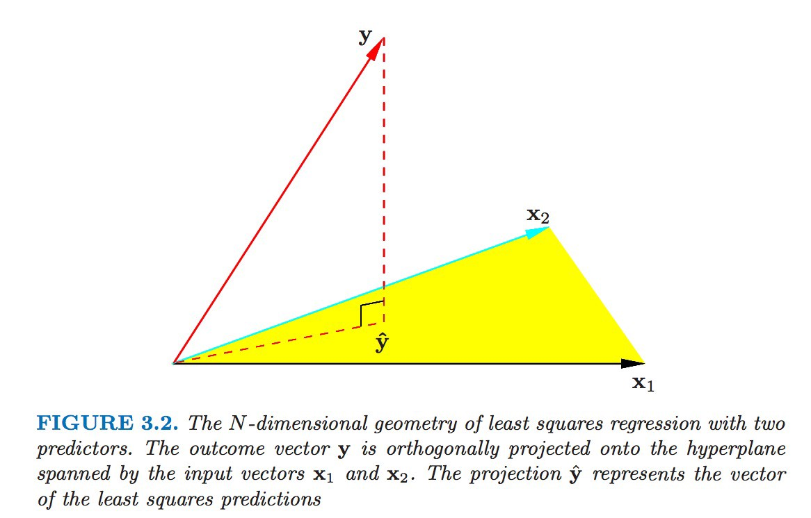

```{r setup, include=FALSE}
knitr::opts_chunk$set(echo = TRUE)
```

# Outline

In this module, we will review linear regression and generalized linear regression

# Linear regression

- Model:
$$
Y_{n \times 1}=X_{n \times p} \beta_{p \times 1}+\epsilon_{n \times 1}
$$
- Equivalently:
$$
y_{i}=x_{i}^{\mathrm{T}} \beta+\epsilon_{i}, \quad i=1, \ldots, n
$$

\pause

- Standard assumptions
  - $y_{i}$ independent (equivalently $\epsilon_{i}$ independent)
  - $\mathbb{E}\left(\epsilon_{i}\right)=0$
  - $\operatorname{var}\left(\epsilon_{i}\right)=\sigma^{2}$, constant
  - $x_{i}$ known, $\beta$ to be estimated

\pause

- More concisely:
$$
\mathbb{E}(Y \mid X)=X \beta, \quad \operatorname{var}(Y \mid X)=\sigma^{2} I
$$

# Interpretation of $\beta_j$

- Effect on the expected response of a unit change in jth explanatory variable, all other variables held fixed

# Least squares estimation

- Definition (minimize the residuals)
$$
\hat{\beta}_{\mathrm{LS}}:=\min _{\beta} \sum_{i=1}^{n}\left(y_{i}-x_{i}^{\mathrm{T}} \beta\right)^{2}
$$
- Equivalently,
$$
\hat{\beta}_{L S}:=\min _{\beta}(y-X \beta)^{\mathrm{T}}(y-X \beta)
$$
- Equivalently (L2 distance),
$$
\hat{\beta}_{\mathrm{LS}}:=\min _{\beta}\|\mathrm{y}-X \beta\|_{2}^{2}
$$

- Equivalently, $\hat{\beta}$ is the solution of the score equation
$$
X^{\mathrm{T}}(y-X \beta)=0
$$

- Solution
$$
\hat{\beta}_{\mathrm{LS}}=\left(X^{\mathrm{T}} X\right)^{-1}\left(X^{\mathrm{T}} \boldsymbol{y}\right)
$$

# Another interpretation: the projection of $Y$ onto the linear subspace spanned by the columns of $\mathbf{X}$


Elements of Statistical Learning, p46

# Least squares estimation (cont'd)

Assume $X$ is fixed, 

- Expected value 

$$\mathbb{E}\left(\hat{\beta}_{\mathrm{LS}}\right)=\left(X^{\mathrm{T}} X\right)^{-1} X^{\mathrm{T}} \mathbb{E}(y)=\left(X^{\mathrm{T}} X\right)^{-1}\left(X^{\mathrm{T}} X\right) \beta=\beta$$

- Variance
$$
\begin{aligned}
\operatorname{var}\left(\hat{\beta}_{L S}\right) &=\left(X^{\mathrm{T}} X\right)^{-1} X^{\mathrm{T}} \operatorname{var}(y) X\left(X^{\mathrm{T}} X\right)^{-1} \\
&=\left(X^{\mathrm{T}} X\right)^{-1} X^{\mathrm{T}} \sigma^{2} I X\left(X^{\mathrm{T}} X\right)^{-1} \\
&=\sigma^{2}\left(X^{\mathrm{T}} X\right)^{-1}
\end{aligned}
$$

# Assumptions for ordinary least squares

- **Linearity**: the expectation of $Y$ is linear in $X_{1} \ldots X_{p}$
- **Independence**: the $\epsilon_{i}$ are independent
- **Mean zero errors**: the $\epsilon_{i}$ have mean zero, i.e. $E\left[\epsilon_{i}\right]=0$
- **Equal variance (homoscedasticity)**: the $\epsilon_{i}$ have the same variance, i.e. $\operatorname{Var}\left[\epsilon_{i}\right]=\sigma^{2}$


# What about normal distribution?

- If we further assume $\epsilon_{i} \sim N\left(0, \sigma^{2}\right)$ (and independent across $i$), then

- $y \mid X \sim N\left(X \beta, \sigma^{2} I\right)$, and
- likelihood function is
$$
L\left(\beta, \sigma^{2} ; y\right)=\frac{1}{\left(2 \pi \sigma^{2}\right)^{n / 2}} \exp \left\{-\frac{1}{2 \sigma^{2}}(y-X \beta)^{T}(y-X \beta)\right\}
$$
- log-likelihood function is
$$
\ell\left(\beta, \sigma^{2} ; y\right)=-\frac{n}{2} \log \left(\sigma^{2}\right)-\frac{1}{2 \sigma^{2}}(y-X \beta)^{\mathrm{T}}(y-X \beta)
$$
- maximum likelihood estimate of $\beta$ is
$$
\hat{\beta}_{M L}=\left(X^{\mathrm{T}} X\right)^{-1} X^{\mathrm{T}} \boldsymbol{y}=\hat{\beta}_{\mathrm{LS}}
$$

# What about normal distribution? (cont'd)

- distribution of $\hat{\beta}$ is normal
$$
\hat{\beta} \sim N_{p}\left(\beta, \sigma^{2}\left(X^{\mathrm{T}} X\right)^{-1}\right)
$$
- distribution of $\hat{\beta}_{j}$ is
$$
N\left(\beta_{j}, \sigma^{2}\left(X^{\mathrm{T}} X\right)_{j j}^{-1}\right), \quad j=1, \ldots, p
$$
- maximum likelihood estimate of $\sigma^{2}$ is 
$$\frac{1}{n}(y-X \hat{\beta})^{\mathrm{T}}(y-X \hat{\beta})$$
- but we use
$$
\tilde{\sigma}^{2}=\frac{1}{n-p}(y-X \hat{\beta})^{\mathrm{T}}(y-X \hat{\beta})
$$


# Maximum likelihood estiamtion vs. OLS

- We did not place any distributional assumptions on the outcome,
  - We only required that $E\left[\epsilon_{i}\right]=0$ with constant variance
  - In other words, OLS is a semiparametric method
  
\pause

- Sometimes, people assume that $\epsilon_{i} \sim N\left(0, \sigma^{2}\right)$, which means
$$
Y_{i} \sim N\left(\beta_{0}+\beta_{1} X_{i 1}+\ldots+\beta_{1} X_{i p}, \sigma^{2}\right)
$$

  - If this additional assumption is made, then we can instead use maximum likelihood estimation for $\boldsymbol{\beta}$
  - This connects to a whole other class of models called generalized linear models (GLMs)
  - Interestingly, in this case, you will end up with the same estimates for $\boldsymbol{\beta}$


# Resources

This tutorial is based on 

- Nancy Reid's STA2101 Methods of Applied Statistics [[links](https://utstat.toronto.edu/reid/sta2101f/sep15-annotated.pdf)]

- Harvard's Biostatistics Preparatory Course Methods  [[links](https://isabelfulcher.github.io/methodsprep/slides/Lecture_5/2018_Lecture_05.pdf)].

# Break


# Outline

In this module, we will review generalized linear regression. 

# Logistic regression

- Each response is binary: $y_i = 1, 0$
- Explanatory variables $x_{i}^{T}$ as usual
- Model
$$
P\left(y_{i}=1 \mid x_{i}\right)=\frac{\exp \left(x_{i}^{\top} \beta\right)}{1+\exp \left(x_{i}^{\top} \beta\right)}
$$


# Generalized linear models (GLMs)

- Generalized Linear Models extend the classical set-up to allow for a wider range of distributions

- GLMs have three pieces
  1. random component: $y_{i} \sim$ some distribution with $E\left[y_{i} | \mathbf{x}_{i}\right]=\mu_{i}$
  2. systematic component: $\mathbf{x}_{i}^{T} \beta$
  3. The link function that links the random and systematic components $g\left(u_{i}\right)=\mathbf{x}_{i}^{T} \beta$
  
- Distributions of $y_i$ comes from exponential family. 

# Exponential family

The random variable $\mathrm{Y}$ belongs to the exponential family of distributions if its support does not depend upon any unknown parameters and its density or probability mass function takes the form
$$
f(y \mid \theta, \phi)=\exp \left(\frac{y \theta-b(\theta)}{a(\phi)}+c(y, \phi)\right)
$$
where $\theta$ is the canonical parameter (related to the mean), $\phi$ is a dispersion parameter (often related to the variance), $b(\theta)$  is the cumulant function (which helps derive the mean and variance), and $c(y, \phi)$ is a normalization term ensuring the density integrates (or sums) to 1.

# Example 1 Gaussian distribution
The Gaussian (Normal) distribution can be written in exponential family form as:

\[
f(y \mid \mu, \sigma^2) = \exp\left( \frac{y\mu - \frac{\mu^2}{2}}{\sigma^2} - \frac{y^2}{2\sigma^2} - \frac{1}{2}\log(2\pi\sigma^2) \right)
\]

where:
\begin{align*}
\theta &= \mu \quad &\text{(natural parameter)} \\
\phi &= \sigma^2 \quad &\text{(dispersion parameter)} \\
b(\theta) &= \frac{\theta^2}{2} \quad &\text{(cumulant function)} \\
c(y, \phi) &= -\frac{y^2}{2\phi} - \frac{1}{2}\log(2\pi\phi) \quad &\text{(normalization term)}
\end{align*}

# Example 2 Poisson distribution
The Poisson distribution with parameter $\lambda$ (rate parameter) can be written in exponential family form as:

\[
f(y \mid \lambda) = \exp\left( y\log\lambda - \lambda - \log(y!) \right)
\]

where:
\begin{align*}
\theta &= \log\lambda \quad &\text{(natural parameter)} \\
\phi &= 1 \quad &\text{(dispersion parameter)} \\
b(\theta) &= e^\theta \quad &\text{(cumulant function)} \\
c(y, \phi) &= -\log(y!) \quad &\text{(normalization term)}
\end{align*}


# Example 3 Binomial distribution
The Binomial distribution with parameters $n$ (number of trials) and $p$ (success probability) can be written in exponential family form as:

\[
f(y \mid p) = \exp\left( y\log\left(\frac{p}{1-p}\right) + n\log(1-p) + \log\binom{n}{y} \right)
\]

where:
\begin{align*}
\theta &= \log\left(\frac{p}{1-p}\right) \quad &\text{(natural parameter, log-odds)} \\
\phi &= 1 \quad &\text{(dispersion parameter)} \\
b(\theta) &= n\log(1 + e^\theta) \quad &\text{(cumulant function)} \\
c(y, \phi) &= \log\binom{n}{y} \quad &\text{(normalization term)}
\end{align*}

<!-- # MGF of exponential family -->
<!-- \footnotesize -->
<!-- \begin{align*} -->
<!-- M_Y(t) &= \mathbb{E}[e^{tY}] \\ -->
<!--        &= \int e^{ty} f(y \mid \theta, \phi) dy \\ -->
<!--        &= \int \exp\left(ty + \frac{y\theta - b(\theta)}{a(\phi)} + c(y, \phi)\right) dy \\ -->
<!--        &= \int \exp\left(\frac{y(\theta + ta(\phi)) - b(\theta)}{a(\phi)} + c(y, \phi)\right) dy \\ -->
<!--        &= \exp\left(\frac{b(\theta + ta(\phi)) - b(\theta)}{a(\phi)}\right)  -->
<!--           \int \exp\left(\frac{y(\theta + ta(\phi)) - b(\theta + ta(\phi))}{a(\phi)} + c(y, \phi)\right) dy \\ -->
<!--        &= \exp\left(\frac{b(\theta + ta(\phi)) - b(\theta)}{a(\phi)}\right) -->
<!-- \end{align*} -->

<!-- # Mean of the exponential family -->


<!-- \begin{align*} -->
<!-- M_Y'(t) &= \frac{d}{dt} \left[ \exp\left(\frac{b(\theta + t a(\phi)) - b(\theta)}{a(\phi)}\right) \right] \\ -->
<!-- &= M_Y(t) \cdot \frac{d}{dt} \left( \frac{b(\theta + t a(\phi)) - b(\theta)}{a(\phi)} \right) \quad \text{(Chain rule)} \\ -->
<!-- &= M_Y(t) \cdot \frac{b'(\theta + t a(\phi)) \cdot a(\phi)}{a(\phi)} \\ -->
<!-- &= M_Y(t) \cdot b'(\theta + t a(\phi)) -->
<!-- \end{align*} -->
<!-- Evaluating at $t=0$ (since $M_Y(0)=1$): -->
<!-- \[ -->
<!-- M_Y'(0) = b'(\theta) = \mu = \mathbb{E}[Y] -->
<!-- \] -->

<!-- # Variance of the exponential family -->

<!-- \begin{align*} -->
<!-- M_Y''(t) &= \frac{d}{dt} \left[ M_Y(t) \cdot b'(\theta + t a(\phi)) \right] \\ -->
<!-- &= M_Y'(t) \cdot b'(\theta + t a(\phi)) + M_Y(t) \cdot b''(\theta + t a(\phi)) \cdot a(\phi)  \\ -->
<!-- &= M_Y(t) \cdot \left[ (b'(\theta + t a(\phi)))^2 + b''(\theta + t a(\phi)) \cdot a(\phi) \right] -->
<!-- \end{align*} -->
<!-- Evaluating at $t=0$: -->
<!-- \[ -->
<!-- M_Y''(0) = \mu^2 + b''(\theta) a(\phi) = \mathbb{E}[Y^2] -->
<!-- \] -->
<!-- Thus the variance is: -->
<!-- \[ -->
<!-- \text{Var}(Y) = M_Y''(0) - [M_Y'(0)]^2 = b''(\theta) a(\phi) -->
<!-- \] -->

# Link function
The second element of the generalization is that instead of modeling the
mean, as before, we will introduce a one-to-one continuous differentiable
transformation $g(\mu_i)$ of the mean $\mu_i = E[y_i]$ and model that
$$
(\mu_i) = \eta_i =  x_i^{\top} \beta
$$
where $\eta_i$ is the linear predictor. The function $g(\cdot)$ is called the link function.

# Link function

Since $g(\cdot)$ is a one-to-one transformation, we can invert it to get the mean:
$$
\mu_i = g^{-1}(\eta_i) = g^{-1}(x_i^{\top} \beta)
$$

Note that we do not transform the response variable $y_i$ itself, but rather the mean of the response variable.

# Link function in R

"glm" has several options for family: 
$$
\begin{aligned}
&\text { binomial (link }=\text { "logit") } \\
&\text { gaussian(link }=\text { "identity") } \\
&\text { Gamma(link }=\text { "inverse") } \\
&\text { inverse.gaussian(link }=" 1 / \mathrm{mu}^{\wedge} 2") \\
&\text { poisson(link }=\text { "log") } \\
&\text { quasi (link }=\text { "identity", variance = "constant") } \\
&\text { quasibinomial (link }=\text { "logit") } \\
&\text { quasipoisson(link }=\text { "log") } 
\end{aligned}
$$

<!-- # MLE -->

<!-- An important practical feature of generalized linear models is that they can all be fit to data using the same algorithm, a form of iteratively re-weighted least squares (IRLS). -->

<!-- \begin{minipage}{0.9\textwidth} -->
<!-- \footnotesize -->
<!-- \begin{enumerate} -->
<!--     \item Initialize $\hat{\mu}_i^{(0)} = y_i + \epsilon$, $\eta_i^{(0)} = g(\hat{\mu}_i^{(0)})$ -->

<!--     \item While not converged: -->
<!--     \begin{itemize} -->
<!--         \item Working response: $z_i = \eta_i^{(k)} + (y_i-\hat{\mu}_i^{(k)})\left(\frac{d\eta}{d\mu}\right)$ -->

<!--         \item Weights: $w_i = \left[V(\hat{\mu}_i^{(k)})\left(\frac{d\mu}{d\eta}\right)^2\right]^{-1}$ -->

<!--         \item Update: $\beta^{(k+1)} = (X^\top WX)^{-1}X^\top Wz$ -->

<!--         \item Update $\eta_i^{(k+1)}$, $\hat{\mu}_i^{(k+1)}$ -->
<!--     \end{itemize} -->
<!-- \end{enumerate} -->
<!-- \end{minipage} -->

<!-- # Gaussian Special Case of IRLS -->

<!-- For linear regression ($Y \sim N(\mu, \sigma^2)$): -->
<!-- \begin{itemize} -->
<!--     \item \textbf{Link}: Identity $g(\mu) = \mu$   -->
<!--     \item \textbf{Variance}: $V(\mu) = 1$ (constant) -->
<!--     \item \textbf{Weights}: $w_i = 1$ (equal weighting) -->
<!--     \item \textbf{Working response}: $z_i = y_i$ (original data) -->
<!-- \end{itemize} -->

<!-- \vspace{0.2cm} -->
<!-- IRLS reduces to ordinary least squares: -->
<!-- \[ -->
<!-- \beta^{(k+1)} = (X^\top X)^{-1}X^\top y \quad \text{(single iteration)} -->
<!-- \] -->

<!-- Key observations:  -->

<!-- - Link derivative $\frac{d\mu}{d\eta}=1$  -->
<!-- - No reweighting needed (homoscedasticity)  -->
<!-- - Exact solution in one step -->

<!-- # Asymptotics -->

<!-- The asymptotic distribution of the MLE $\hat{\beta}$ is given by: -->

<!-- $$ -->
<!-- \sqrt{n}(\hat{\beta}-\beta) \xrightarrow{d} N(0, (X^\top W X)^{-1}\phi) -->
<!-- $$ -->

<!-- In the case of the Gaussian distribution, $\phi$ is the variance $\sigma^2$, W is the identity matrix, and the covariance matrix simplifies to: $(X^\top  X)^{-1}\sigma^2$. -->
