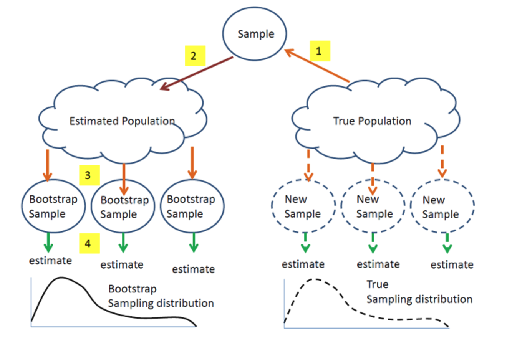

```{r setup, include=FALSE}
knitr::opts_chunk$set(echo = TRUE)
```

# Outline

In this module, we will review

-   Simulation Study
-   Rationale for Simulations
-   Parallel Computing in R

# Simulation study

-   Simulation: A numerical techniques for conducting experiments on the
    computer

-   Monte Carlo simulation: Computer experiment involving random
    sampling from probability distributions

# Why simulation?

To establish/validate the properties of statistical methods

-   Exact analytical derivations of properties are **rarely** possible
-   Large sample approximations to properties are **often possible**,
    but need to evaluate their relevance to (finite) sample sizes likely
    to be encountered in practice

\pause

Moreover, analytical results may require **assumptions** (e.g.,
normality)

-   But what happens when these assumptions are violated?
-   Analytical results, even large sample ones, may not be possible

# Considerations for simulation

-   Is an estimator **biased** in finite samples? Is it still
    **consistent** under departures from assumptions? What is its
    **sampling variance**?
-   How does it **compare** to competing estimators on the basis of
    bias, precision, etc.? \pause
-   Does a procedure for constructing a **confidence interval** for a
    parameter achieve the advertised **nominal level of coverage**?
-   Does a **hypothesis testing** procedure attain the advertised
    **level** or **size**?
-   If it does, what **power** is possible against different
    alternatives to the null hypothesis? Do different test procedures
    deliver different power?

# Monte Carlo simulation

-   Generate $S$ independent data sets under the conditions of interest
-   Compute the numerical value of the estimator/test statistic $T$
    (data) for each data set $\Rightarrow T_{1}, \ldots, T_{S}$
-   If $S$ is large enough, **summary statistics** across
    $T_{1}, \ldots, T_{S}$ should be good **approximations** to the true
    sampling properties of the estimator/test statistic under the
    conditions of interest

# Simulations for properties of estimators

Example: Compare 3 estimators for the **mean** $\mu$ of a distribution
based on i.i.d. draws $Y_{1}, \ldots, Y_{n}$

-   Sample mean $T^{(1)}$
-   Sample 20% trimmed mean $T^{(2)}$
-   Sample median $T^{(3)}$

# Simulations for properties of estimators (cont'd)

**Simulation procedure**: For a particular choice of $\mu, n$, and true
underlying distribution

-   Generate independent draws $Y_{1}, \ldots, Y_{n}$ from the
    distribution

-   Compute $T^{(1)}, T^{(2)}, T^{(3)}$

-   Repeat $S$ times
    $T_{1}^{(1)}, \ldots, T_{S}^{(1)} ; \quad T_{1}^{(2)}, \ldots, T_{S}^{(2)} ; \quad T_{1}^{(3)}, \ldots, T_{S}^{(3)}$

-   Compute for $k=1,2,3$ $$
    \widehat{\mu}=S^{-1} \sum_{s=1}^{S} T_{s}^{(k)}=\bar{T}^{(k)}, \widehat{\text { bias }}=\bar{T}^{(k)}-\mu
    $$

$$
\widehat{\sigma}=\sqrt{(S-1)^{-1} \sum_{s=1}^{S}\left(T_{s}^{(k)}-\bar{T}^{(k)}\right)^{2}}
$$ $$
\widehat{\mathrm{MSE}}=S^{-1} \sum_{s=1}^{S}\left(T_{s}^{(k)}-\mu\right)^{2} \approx \widehat{\mathrm{SD}}^{2}+\widehat{\mathrm{bias}}^{2}
$$

# Simulations for properties of estimators (cont'd)

Another important property we care about is the **relative efficiency**
(RE).

-   If the estimators are unbiased, $$
    R E=\frac{\operatorname{var}\left(T^{(1)}\right)}{\operatorname{var}\left(T^{(2)}\right)}
    $$

-   If the estimators are biased, $$
    R E=\frac{\operatorname{MSE}\left(T^{(1)}\right)}{\operatorname{MSE}\left(T^{(2)}\right)}
    $$

In either case $R E<1$ means estimator 1 is preferred (estimator 2 is
inefficient relative to estimator 1 in this sense)

# Set up parameters

```{r}
set.seed(123)
# number of simulations
S <- 1e5
# sample size
n <- 1000
# mu and sigma
mu <- 1
sigma <- sqrt(5 / 3)
# function
trimmean <- function(Y) mean(Y, 0.2)
```

# Run Simulation (for loop)

```{r cache = TRUE}
start_time <- Sys.time()
t1 <- t2 <- t3 <- c()
for (s in 1:S) {
  # generate data
  dat <- rnorm(n, mu, sigma)
  # calculate T1
  t1 <- c(t1, mean(dat))
  # calculate T2
  t2 <- c(t2, trimmean(dat))
  # calculate T3
  t3 <- c(t3, median(dat))
}
end_time <- Sys.time()
end_time - start_time
```

# Bias?

```{r}
mean(t1 - 1)
mean(t2 - 1)
mean(t3 - 1)
```

-   All estimators are shown minimal bias, why?

# Sample Variance?

```{r}
var(t1)
var(t2)
var(t3)
```

# Relative Efficiency?

```{r}
cat("T1 vs T2", (mean(t2 - 1)^2 + var(t2)) /
  (mean(t1 - 1)^2 + var(t1)), "\n")
cat("T1 vs T3", (mean(t3 - 1)^2 + var(t3)) /
  (mean(t1 - 1)^2 + var(t1)), "\n")
cat("T2 vs T3", (mean(t3 - 1)^2 + var(t3)) /
  (mean(t2 - 1)^2 + var(t2)), "\n")
```

# Run Simulation (lapply)

\small

```{r}
start_time <- Sys.time()
t <- lapply(1:S, function(s) {
  # generate data
  dat <- rnorm(n, mu, sigma)
  # calculate T1
  t1 <- mean(dat)
  # calculate T2
  t2 <- trimmean(dat)
  # calculate T3
  t3 <- median(dat)
  c(t1, t2, t3)
})
end_time <- Sys.time()
end_time - start_time

# convert t to a dataframe with column t1, t2, t3
t_final <- do.call(rbind, t)
```

# Run Simulation (Vectorize)

```{r}
generate.normal <- function(S, n, mu, sigma) {
  dat <- matrix(rnorm(n * S, mu, sigma), ncol = n, byrow = T)
  out <- list(dat = dat)
  return(out)
}
```

```{r}
start_time <- Sys.time()
out <- generate.normal(S, n, mu, sigma)
out_mean <- apply(out$dat, 1, mean)
out_trimmean <- apply(out$dat, 1, trimmean)
out_median <- apply(out$dat, 1, median)
end_time <- Sys.time()
end_time - start_time
```

# Introduction to Embarrassing Parallelism

-   `for loop` execute each task sequentially

-   Modern computers are built in with multiple cores that allows you do
    the above jobs in parallel

-   Rise of high performance computing (HPC) cluster

-   The improvement is not linear!

# Parallel in local computer (foreach)

-   most intuitive parallel algorithm, just like `for loop`
-   need to set-up the local cluster

\tiny

```{r}
library(doParallel)
detectCores()

cl <- makeCluster(8)
registerDoParallel(cl)
start_time <- Sys.time()
t <- foreach(s = 1:S, .combine = "rbind") %dopar% {
  # generate data
  dat <- rnorm(n, mu, sigma)
  # calculate T1
  t1 <- mean(dat)
  # calculate T2
  t2 <- trimmean(dat)
  # calculate T3
  t3 <- median(dat)

  c(t1, t2, t3)
}
end_time <- Sys.time()
end_time - start_time
```

# Parallel in local computer (mclapply)
\tiny

-   The `mclapply()` function essentially parallelizes calls to
    `lapply()`
    - Note: This does not work on Windows

```{r message=FALSE, warning=FALSE, eval=FALSE}
library(parallel)

start_time <- Sys.time()
t <- mclapply(1:S, function(s) {
  # generate data
  dat <- rnorm(n, mu, sigma)
  # calculate T1
  t1 <- mean(dat)
  # calculate T2
  t2 <- trimmean(dat)
  # calculate T3
  t3 <- median(dat)
  c(t1, t2, t3)
}, mc.cores = 4)
end_time <- Sys.time()
end_time - start_time

# convert t to a dataframe with column t1, t2, t3
t_final <- do.call(rbind, t)
```

# Parallel in local computer (parLapply)
\tiny
```{r, error=TRUE}
cl <- makeCluster(8)
registerDoParallel(cl)
start_time <- Sys.time()
t <- parLapply(cl = cl, X = 1:S, function(s) {
  # generate data
  dat <- rnorm(n, mu, sigma)
  # calculate T1
  t1 <- mean(dat)
  # calculate T2
  t2 <- trimmean(dat)
  # calculate T3
  t3 <- median(dat)
  c(t1, t2, t3)
})
end_time <- Sys.time()
end_time - start_time

# convert t to a data frame with column t1, t2, t3
t_final <- do.call(rbind, t)
```

# parLapply continued
\tiny
-   need to export the environment

```{r}
clusterExport(cl, varlist = c("n", "mu", "sigma", "trimmean"))
start_time <- Sys.time()
t <- parLapply(cl = cl, X = 1:S, function(s) {
  # generate data
  dat <- rnorm(n, mu, sigma)
  # calculate T1
  t1 <- mean(dat)
  # calculate T2
  t2 <- trimmean(dat)
  # calculate T3
  t3 <- median(dat)
  c(t1, t2, t3)
})
end_time <- Sys.time()
end_time - start_time

# convert t to a data frame with column t1, t2, t3
t_final <- do.call(rbind, t)
```

# Error Handling (foreach)

```{r, error=TRUE}
t <- foreach(
  i = 1:1e4, .combine = "rbind"
) %dopar% {
  # generate data
  A <- matrix(data = rbinom(4, 1, 0.5), nrow = 2)
  solve(A)
}
```

-   The error may only occur occasionally
-   You want to ignore the error and finish your job

# Error Handling (foreach)

```{r}
t <- foreach(
  i = 1:1e4,
  .errorhandling = "pass"
) %dopar% {
  # generate data
  A <- matrix(data = rbinom(4, 1, 0.5), nrow = 2)
  solve(A)
}

head(t, 2)
```

# Error Handling (foreach)
\small
```{r}
t <- foreach(
  i = 1:1e4,
  .errorhandling = "remove"
) %dopar% {
  # generate data
  A <- matrix(data = rbinom(4, 1, 0.5), nrow = 2)
  solve(A)
}
head(t, 2)
```

# Error Handling (tryCatch)
\tiny
-   `tryCatch` enables you to handle **errors** and **warnings**

```{r}
t <- parLapply(cl, X = 1:1e4, fun = function(x) {
  # generate data
  tryCatch(
    {
      A <- matrix(data = rbinom(4, 1, 0.5), nrow = 2)
      solve(A)
    },
    error = function(e) {
      # code that will be executed in the event of an error
      return(NA)
    }
  )
})

head(t, 2)
```

# Error Handling (tryCatch)
\tiny
-   Often times, warning messages are not outputed in the parallel
    process

```{r}
sigma <- -1
t <- parLapply(cl = cl, X = 1:S, function(s) {
  # generate data
  dat <- rnorm(n, mu, sigma)
  # calculate T1
  t1 <- mean(dat)
  # calculate T2
  t2 <- trimmean(dat)
  # calculate T3
  t3 <- median(dat)
  c(t1, t2, t3)
})
head(t, 2)
```

# Error Handling (tryCatch)
\tiny
```{r}
sigma <- -1
t <- parLapply(cl = cl, X = 1:S, function(s) {
  tryCatch(
    {
      # generate data
      dat <- rnorm(n, mu, sigma)
      # calculate T1
      t1 <- mean(dat)
      # calculate T2
      t2 <- trimmean(dat)
      # calculate T3
      t3 <- median(dat)
      c(t1, t2, t3)
    },
    warning = function(w) {
      # code that will be executed in the event of a warning
      return(w)
    }
  )
})
head(t, 2)
```

# Parallel in HPC

-   Using Niagara cluster (Compute Canada) as an example, it contains
    2024 nodes, each with 40 cores, for a total of 80,640 cores.
-   Say if you want to request 20 cores, there are two ways to request
    it
    -   1 node and all 20 cores on the node
    -   different nodes
    
# One node Prallel

\tiny

```{r, eval=FALSE}
cl <- makeCluster(20)
registerDoParallel(cl)
clusterExport(cl, varlist = c("n", "mu", "sigma", "trimmean"))
t <- parLapply(cl = cl, X = 1:S, function(s) {
  # generate data
  dat <- rnorm(n, mu, sigma)
  # calculate T1
  t1 <- mean(dat)
  # calculate T2
  t2 <- trimmean(dat)
  # calculate T3
  t3 <- median(dat)
  c(t1, t2, t3)
})

# convert t to a data frame with column t1, t2, t3
t_final <- do.call(rbind, t)

# save the results
saveRDS(t_final, "t_final.rds")
```

save the R script as `example.R`

# One node Prallel

Use `module spider r` to check the requirement for loading R

```bat
#!/bin/bash
#SBATCH --nodes=1
#SBATCH --ntasks-per-node=20
#SBATCH --time=0-01:30           # time (DD-HH:MM)
module load gcc/9.3.0 r/4.0.2              

Rscript example.R
```

Save it as `submit.sh`

Submit the job by `sbatch submit.sh`

# Multiple Nodes

- things are much more complicated
- sometimes cannot be avoided, say if you want to request 800 cores
- need to use `OpenMPI`


# Multiple Nodes
\tiny
```{r, eval=FALSE}
cl <- makeCluster(800, type = "MPI")
registerDoParallel(cl)
t <- parLapply(cl = cl, X = 1:S, function(s) {
  # generate data
  dat <- rnorm(n, mu, sigma)
  # calculate T1
  t1 <- mean(dat)
  # calculate T2
  t2 <- trimmean(dat)
  # calculate T3
  t3 <- median(dat)
  c(t1, t2, t3)
})

# convert t to a data frame with column t1, t2, t3
t_final <- do.call(rbind, t)

# save the results
saveRDS(t_final, "t_final.rds")
```

save the R script as `example.R`

# Multiple Nodes
\small
```bat
#!/bin/bash
#SBATCH --nodes=20
#SBATCH --ntasks-per-node=40
#SBATCH --time=0-01:30           # time (DD-HH:MM)
module load gcc/9.3.0 openmpi/4.0.3 r/4.0.2              

R_PROFILE=${HOME}/R/x86_64-pc-linux-gnu-library/4.0/snow/
RMPISNOWprofile; 
export R_PROFILE
mpirun -np 800 -bind-to core:overload-allowed R CMD BATCH 
--no-save example.R
```
Save it as `submit.sh`

Submit the job by `sbatch submit.sh`

# Passing argument

- sometimes you may want to run for a set of arguments
- e.g. n = c(100, 200, 300, 400)

\tiny 
```{r, eval=FALSE}
args <- commandArgs(TRUE)
n <- args[1]

cl <- makeCluster(800, type = "MPI")
registerDoParallel(cl)
clusterExport(cl, varlist = c("n", "mu", "sigma", "trimmean"))

t <- parLapply(cl = cl, X = 1:S, function(s) {
  # generate data
  dat <- rnorm(n, mu, sigma)
  # calculate T1
  t1 <- mean(dat)
  # calculate T2
  t2 <- trimmean(dat)
  # calculate T3
  t3 <- median(dat)
  c(t1, t2, t3)
})

# convert t to a data frame with column t1, t2, t3
t_final <- do.call(rbind, t)
# save the results
saveRDS(t_final, "t_final.rds")
```

# Passing argument
\tiny 
```bat
#!/bin/bash
#SBATCH --nodes=20
#SBATCH --ntasks-per-node=40
#SBATCH --time=0-01:30           # time (DD-HH:MM)
module load gcc/9.3.0 openmpi/4.0.3 r/4.0.2              

R_PROFILE=${HOME}/R/x86_64-pc-linux-gnu-library/4.0/snow/RMPISNOWprofile; export R_PROFILE
mpirun -np 800 -bind-to core:overload-allowed R CMD BATCH --no-save "--args $n" example.R
```
Save it as `submit.sh`

Submit the job by 
```bat
for n in 100 200 300 400
do
  sbatch --export=n=$n submit.sh
done
```

# Break


# Outline

In this module, we will continue our discussion on Bootstrap.


# What is bootstrap?

A widely applicable, computer intensive resampling method used to compute standard errors, confidence intervals, and significance tests.

# Why bootstrap?

- The exact sampling distribution of an estimator can be **difficult** to obtain
- Asymptotic expansions are sometimes easier but expressions for standard errors based on large sample theory may not perform well in finite samples

# 


https://online.stat.psu.edu/stat555/node/119/

# Example:  estimate the variance of an estimator

Now let $\operatorname{Var}_F\left(T_n\right)$ denote the variance of $T_n$. The subscript $F$ means the variance is a function of $F$ where $F$ is the CDF of $X$. If we know $F$, we can directly compute the variance. For example, if then $x_1, \cdots, x_w$ iid
$$
T_n=\bar{X}_n,=\frac{1}{n} \sum_{i=1}^n x_i
$$
$$
\operatorname{Var}_F\left(T_n\right)=n^{-1}\left(\int x^2 d F(x)-\left(\int x d F(x)\right)^2\right)
$$
which is a function of $F$.

# Example:  estimate the variance of an estimator

When $F$ is unknown, one can use an estimate of $F$, e.g., the empirical CDF $\hat{F}_n$, i.e.,
$$
\hat{F}_n(x)=\frac{\sum_{i=1}^n \mathbf{1}\left(X_i \leq x\right)}{n} .
$$
We then use a plug-in estimator for $\operatorname{Var}_{\hat{F}_n}\left(T_n\right)$ :
$$
\operatorname{Var}_{\hat{F}_n}\left(T_n\right)=n^{-1}\left(\int x^2 d \hat{F}_n(x)-\left(\int x d \hat{F}_n(x)\right)^2\right) .
$$

# Example:  estimate the variance of an estimator

However, the plug-in estimator above can be hard to compute, we can then approximate it with a simulation estimate, denoted by $V_{\text {boot }}$.

The following algorithm illustrate how one can do this through bootstrap.

\begin{tabular}{l}
\hline Algorithm 1: Bootstrap variance estimation algorithm \\
\hline Input data $\left(X_1, \ldots, X_n\right) ;$ Number of iteration $B ;$ \\
for $i \leftarrow 0$ to $B$ do \\
$\quad \begin{array}{l}\text { Draw } X_{1, i}^*, \ldots, X_{n, i}^* \sim \hat{F}_n ; \\
\text { Compute } T_{n, i}^*=g\left(X_{1, i}^*, \ldots, X_{n, i}^*\right) ;\end{array}$ \\
end \\
$V_{\text {boot }}=\frac{1}{B} \sum_{i=1}^B\left(T_{n, i}^*-\frac{1}{B} \sum_{j=1}^B T_{n, j}^*\right)^2$. \\
\hline \end{tabular}

By law of large numbers, we have $V_{\text {boot }} \stackrel{\text { a.s. }}{\longrightarrow} \operatorname{Var}_{\hat{F}_n}\left(T_n\right)$ 
as $B \rightarrow \infty$.


# The bootstrap principle

Suppose $X=\left\{X_{1}, \ldots, X_{n}\right\}$ is a sample used to estimate some parameter $\theta=T(P)$ of the underlying distribution $P$. To make inference on $\theta$, we are interested in the properties of our estimator $\hat{\theta}=S(X)$ for $\theta$.

\pause

- If we knew $P$, 
  - we could obtain $\left\{X^{b} \mid b=1, \ldots B\right\}$ from $P$ and use Monte-Carlo to estimate the sampling distribution of $\hat{\theta}$ 
  
\pause
  
- However, we don't, 
  - we do the next best thing and resample from original sample, i.e. the empirical distribution, $\hat{P}$
  - we expect the empirical distribution to estimate the underlying distribution well by the _Glivenko-Cantelli_ Theorem

# Why bootstrap works

Definition 2.1. Let $F, G$ be two CDF's on a sample space $X$. Let $\rho(F, G)$ be a metric on the space of CDF's on $X$. We say $G_n^*$ is weakly $\rho$-consistent if
$$
\rho\left(G_n^*, G_n\right) \stackrel{P}{\rightarrow} 0
$$
as $n \rightarrow \infty$. Similarly, $G_n^*$ is strongly $\rho$-consistent if
$$
\rho\left(G_n^*, G_n\right) \stackrel{\text { a.s. }}{\longrightarrow} 0 .
$$

# Why bootstrap works

Now the measure of closeness between two CDF's depends on the metric $\rho$. The following two metrics are commonly used for the CDF's:

(i) Kolmogorov metric:
$$
K(F, G)=\sup _{x \in R}|F(x)-G(x)| .
$$

(ii) Mallows-Wasserstein metric:
$$
l_2(F, G)=\inf _{T_{F, G}}\left(E|Y-X|^2\right)^{1 / 2},
$$
where $T_{F, G}$ is the collection of all possible joint distribution of the pair $(X, Y)$ whose marginal distributions are $F, G$.
The following theorem illustrates a special case of the bootstrap theory.

# Why bootstrap works

Theorem. Suppose $X_1, \ldots, X_n \stackrel{\text { i.i.d. }}{\sim} F$ and $E\left(X_i^2\right)<\infty$. Let
$$
T_n=g\left(X_1, \ldots, X_n\right)=\sqrt{n}(\bar{X}-\mu).
$$
For the bootstrap version $T_n^* = \sqrt{n}(\bar{X}_n^* - \bar{X}_n)$:
\[
K(G_n^*, G_n) \xrightarrow{a.s.} 0 \quad \text{and} \quad l_2(G_n^*, G_n) \xrightarrow{a.s.} 0
\]
where:
\begin{align*}
G_n(t) &= P(T_n \leq t) \quad \text{(True CDF)} \\
G_n^*(t) &= P(T_n^* \leq t \mid X_1, \dots, X_n) \quad \text{(Bootstrap CDF)}
\end{align*}

# Practical Implementation

\begin{block}{Monte Carlo Approximation}
For finite samples, estimate $G_n^*$ via:
\[
\hat{G}_n^*(t) = \frac{1}{B}\sum_{b=1}^B \mathbb{I}(T_{n,b}^* \leq t)
\]
where:
\begin{itemize}
\item $B$ = number of bootstrap samples
\item $T_{n,b}^* = \sqrt{n}(\bar{X}_{n,b}^* - \bar{X}_n)$
\end{itemize}
\end{block}

\begin{exampleblock}{Convergence}
\begin{center}
\begin{tabular}{cc}
$B \to \infty$ & $\hat{G}_n^* \to G_n^*$ \\
$n \to \infty$ & $G_n^* \to G_n$ \\
\end{tabular}
\end{center}
\end{exampleblock}


# Bootstrap confidence intervals

For a statistic $T_n$ with bootstrap replicates $\{T_{n,b}^*\}_{b=1}^B$:
\begin{itemize}
\item \textbf{Normal Approximation CI} (requires normality): \[
T_n \pm z_{\alpha/2}\widehat{se}_{boot}
\]
where $\widehat{se}_{boot}  = \sqrt{\frac{1}{B-1}\sum_{b=1}^B (T_{n,b}^* - \bar{T}^*)^2}$
\item \textbf{Pivotal (Basic) Bootstrap CI}:
\[
\Big(2T_n - T_{((1-\alpha/2)B)}^*, \ 2T_n - T_{((\alpha/2)B)}^*\Big)
\]

\item \textbf{Percentile Bootstrap CI}:
\[
\Big(T_{((\alpha/2)B)}^*, \ T_{((1-\alpha/2)B)}^*\Big)
\]
\end{itemize}

# Bootstrap confidence intervals
\begin{alertblock}{Important Notes}
\begin{itemize}
\item Normal CI assumes asymptotic normality of $T_n$
\item Pivotal CI inverts the bootstrap distribution
\item Percentile CI is simple but may be biased
\end{itemize}
\end{alertblock}

# Forms of bootstrap

Based on how the population is estimated, 

1. Nonparametric bootstrap
2. Parametric bootstrap
2. Empirical Bootstrap (Paired Bootstrap) 
3. Residual Bootstrap 
4. Wild Bootstrap

# Nonparametric bootstrap (resampling)

\begin{block}{Core Idea}
Resample \textit{with replacement} from original data to approximate sampling distribution of statistic $\hat{\theta} = S(\mathbf{D})$
\end{block}

\pause
\begin{enumerate}
\item \textbf{Resampling}: Generate $B$ bootstrap datasets \\
$\mathbf{D}^*(1), \ldots, \mathbf{D}^*(B)$ where each $\mathbf{D}^*(b)$ contains $n$ observations drawn \textit{with replacement} from original data $\mathbf{D} = (X_1,\ldots,X_n)$

\pause
\item \textbf{Replication}: Compute bootstrap statistics \\
$\hat{\theta}^*(b) = S(\mathbf{D}^*(b))$ for $b=1,\ldots,B$

\pause
\item \textbf{Standard Error Estimation}:
\[
\widehat{se}_{boot} = \sqrt{\frac{1}{B-1}\sum_{b=1}^B \left(\hat{\theta}^*(b) - \bar{\theta}^*\right)^2}
\]
where $\bar{\theta}^* = \frac{1}{B}\sum_{b=1}^B \hat{\theta}^*(b)$
\end{enumerate}


# Parametric bootstrap 

- Assumes the data comes from a known distribution with unknown parameters

- First estimate the parameters from the data and then use the estimated distribution to simulate the samples

# Bootstrap for Regression 

Bootstrap can also be used to conduct statistical inference for regression model. Let $\left(X_1, Y_1\right), \ldots,\left(X_n, Y_n\right)$ be the observed data and
$$
E\left(Y_i \mid X_i=x\right)=\beta_0+\beta_1 x,
$$
i.e.,
$$
Y_i=\beta_0+\beta_1 X_i+\epsilon_i .
$$
There are several variants to the bootstrap under regression setting.

# Empirical Bootstrap (Paired Bootstrap) 

We generate a new sets of i.i.d. observations $\left(X_1^*, Y_1^*\right), \ldots,\left(X_n^*, Y_n^*\right)$ such that for each $l$,
$$
P\left(X_l^*=X_i, Y_l^*=Y_i\right)=\frac{1}{n}
$$
for all $i$. Similar to bootstrap estimation of variance, we repeat this procedure $B$ times and fit a linear regression model for each of the generated paired data:
$$
\begin{gathered}
\left(X_1^{*(1)}, Y_1^{*(1)}\right), \ldots,\left(X_n^{*(1)}, Y_n^{*(1)}\right) \stackrel{\text { fit linear regression }}{\longrightarrow} \hat{\beta}_0^{*(1)}, \hat{\beta}_1^{*(1)} \\
\ldots \\
\left(X_1^{*(B)}, Y_1^{*(B)}\right), \ldots,\left(X_n^{*(B)}, Y_n^{*(B)}\right) \stackrel{\text { fit linear regression }}{\longrightarrow} \hat{\beta}_0^{*(B)}, \hat{\beta}_1^{*(B)} .
\end{gathered}
$$

# Empirical Bootstrap (Paired Bootstrap) 

We then estimate the bootstrap variance
$$
\hat{\operatorname{Var}}\left(\hat{\beta}_0\right)=\frac{1}{B} \sum_{l=1}^B\left(\hat{\beta}_0^{*(l)}-\bar{\beta}_0^*\right)^2, \bar{\beta}_0^*=\frac{1}{B} \sum_{i=1}^B \hat{\beta}_0^{*(l)},
$$
and
$$
\hat{\operatorname{Var}}\left(\hat{\beta}_1\right)=\frac{1}{B} \sum_{l=1}^B\left(\hat{\beta}_1^{*(l)}-\bar{\beta}_1^*\right)^2, \bar{\beta}_1^*=\frac{1}{B} \sum_{l=1}^B \hat{\beta}_1^{*(l)} .
$$
We can also obtain the bootstrap CI as
$$
\hat{\beta}_0 \pm z_{1-\alpha / 2} \sqrt{\hat{\operatorname{Var}}\left(\hat{\beta}_0\right)}
$$
and
$$
\hat{\beta}_1 \pm z_{1-\alpha / 2} \sqrt{\hat{\operatorname{Var}}\left(\hat{\beta}_1\right)}
$$

# Empirical Bootstrap (Paired Bootstrap) 

Although empirical bootstrap works well in practice, it may lead to a bad results, especially in the presence of influential observations (some $X_i$ 's are very far away from the others). 

This will also strongly affect the empirical bootstrap in the sense that if an empirical bootstrap does not select these influential points, the regression coefficients can be very different.

# Residual Bootstrap 

To solve the problem of empirical bootstrap illustrated previously, we may use the residual bootstrap. We first fit the original data to obtain the OLS estimate $\hat{\beta}_0, \hat{\beta}_1$. Define
$$
e_i=Y_i-\hat{Y}_i=Y_i-\hat{\beta}_0-\hat{\beta}_1 X_i .
$$
$e_i$ here are the fitted residuals and can be regarded as a good approximation of $\epsilon_i$.
The residual bootstrap generate i.i.d. $\hat{\epsilon}_1^*, \ldots, \hat{\epsilon}_n^*$ such that for each $\hat{\epsilon}_l^*$,
$$
P\left(\hat{\epsilon}_l^*=e_i\right)=\frac{1}{n} .
$$
Then we generate a new bootstrap sample
$$
\left(X_1^*, Y_1^*\right), \ldots,\left(X_n^*, Y_n^*\right)
$$
via
$$
X_i^*=X_i, Y_i^*=\hat{\beta}_0+\hat{\beta}_1 X_i+\hat{\epsilon}_i^* .
$$

# Wild Bootstrap

Another issue usually occur in linear regression is the so called phenomenon of heteroskedasticity, i.e., $\operatorname{Var}\left(\epsilon_i \mid X_i\right)$ depends on the value of $X_i$. 

Now residual bootstrap cannot deal with this issue. In particular, the residual bootstrap will be unstable because the residual bootstrap will swap all the residuals regardless of the value of the covariate. The solution to this is through the wild bootstrap.

The wild bootstrap first generate i.i.d. random variables $V_1, \ldots, V_n \sim \mathcal{N}(0,1)$ and then generate the bootstrap sample
$$
\left(X_1^*, Y_1^*\right), \ldots,\left(X_n^*, Y_n^*\right)
$$
by
$$
Y_i^*=\hat{\beta}_0+\hat{\beta}_1 X_i+V_i e_i, X_i^*=X_i .
$$

# Bootstrap hypothesis testing

\tiny
```{r, eval = F}
boot_dat <- function(x, n, mu, std) {
  newx <- sample(x, n, replace = T)
  return((mean(newx) - mu)/(std/sqrt(n)))
}


pvalues_1 <- rep(NA, nsim)
pvalues_2 <- rep(NA, nsim)

for (i in 1:nsim){
  x <- rnorm(n, mean = mu, sd = std)
  stat <- abs((mean(x) - mu)/(std/sqrt(n)))
  pvalues_1[i] <- 2*(1 - pnorm(stat))
  
  
  newx <- x - mean(x) + mu
  boot_scores <- sapply(1:nboot, 
                        function(index) boot_dat(newx, n, mu, std))
  boot_scores <- as.vector(boot_scores)
  # hist(boot_scores)
  # mean(boot_scores)
  pvalues_2[i] <- length(which(boot_scores > stat))/length(boot_scores) + 
    length(which(boot_scores < (-stat)))/length(boot_scores)
}
```

# Failures of Bootstrap 

Let $X_1, \ldots, X_n \stackrel{\text { i.i.d. }}{\sim}$ unif $(0,1)$ and $M_n=\min \left(X_1, \ldots, X_n\right)$ be the minimum of the sample. One can show that
$$
n M_n \stackrel{\mathcal{D}}{\rightarrow} \exp (1)
$$
However, let $M_n^*=\min \left(X_1^*, \ldots, X_n^*\right)$ be the minimum of a bootstrap sample, then
$$
P\left(\text { none of } X_1^*, \ldots, X_n^* \text { select } M_n\right)=\left(1-\frac{1}{n}\right)^n \approx e^{-1},
$$
which implies that
$$
P\left(M_n^*=M_n\right) \approx 1-e^{-1} .
$$
Therefore, $M_n^*$ has a huge probability mass at $M_n$. This means the distribution of $M_n^*$ is very different from the distribution of $M_n$. The detailed proof is left as homework.

# StatQuest videos 

Check out these videos made by Josh Starmer with vivid illustration for the boostrap! 

- Bootstrapping Main Ideas [[link](https://youtu.be/Xz0x-8-cgaQ)]

- Using Bootstrapping to Calculate p-values [[link](https://youtu.be/N4ZQQqyIf6k)]


# Resources

This tutorial is based on 

- PennState STAT555 Statistical Analysis of Genomics Data [[links](https://online.stat.psu.edu/stat555/node/119/)].

- Harvard's Biostatistics Preparatory Course Methods  [[links](https://isabelfulcher.github.io/methodsprep/slides/Lecture_7/2018_Lecture_07.pdf)].


<!-- # View the estimator properties -->

<!-- \tiny -->

<!-- ```{r} -->
<!-- simsum <- function(dat, trueval) { -->
<!--   S <- nrow(dat) -->

<!--   MCmean <- apply(dat, 2, mean) -->
<!--   MCbias <- MCmean - trueval -->
<!--   MCrelbias <- MCbias / trueval -->
<!--   MCstddev <- sqrt(apply(dat, 2, var)) -->
<!--   MCMSE <- apply((dat - trueval)^2, 2, mean) -->
<!--   #  MCMSE <- MCbias^2 + MCstddev^2   # alternative lazy calculation -->
<!--   MCRE <- MCMSE[1] / MCMSE -->

<!--   sumdat <- rbind( -->
<!--     rep(trueval, 3), S, MCmean, MCbias, -->
<!--     MCrelbias, MCstddev, MCMSE, MCRE -->
<!--   ) -->
<!--   names <- c( -->
<!--     "true value", "# sims", "MC mean", "MC bias", "MC relative bias", -->
<!--     "MC standard deviation", "MC MSE", "MC relative efficiency" -->
<!--   ) -->
<!--   ests <- c("Sample mean", "Trimmed mean", "Median") -->

<!--   dimnames(sumdat) <- list(names, ests) -->
<!--   round(sumdat, 5) -->
<!-- } -->
<!-- ``` -->

<!-- # View the estimator properties (cont'd) -->

<!-- \tiny -->

<!-- ```{r} -->
<!-- results <- simsum(summary.sim, mu) -->
<!-- results -->
<!-- ``` -->

<!-- # Performance of estimates of uncertainty -->

<!-- How well do estimated standard errors represent the true sampling -->
<!-- variation? -->

<!-- -   Compare the average of the estimated standard errors to MC standard -->
<!--     deviation. -->

<!-- -   For sample mean $\bar{Y}$, -->
<!--     $S E(\bar{Y})=\frac{s}{\sqrt{n}}, \quad s^{2}=(n-1)^{-1} \sum_{j=1}^{n}\left(Y_{j}-\bar{Y}\right)^{2}$ -->

<!-- ```{r} -->
<!-- results["MC standard deviation", "Sample mean"] -->
<!-- ``` -->

<!-- ```{r} -->
<!-- mean_se <- sqrt(apply(out$dat, 1, var) / n) -->
<!-- ave_mean_se <- mean(mean_se) -->
<!-- round(ave_mean_se, 3) -->
<!-- ``` -->

<!-- # Confidence interval -->

<!-- Based on the sample mean, $$ -->
<!-- \left[\bar{Y}-t_{1-\alpha / 2, n-1} \frac{s}{\sqrt{n}}, \bar{Y}+t_{1-\alpha / 2, n-1} \frac{s}{\sqrt{n}}\right] -->
<!-- $$ -->

<!-- Does the interval achieve the nominal level of coverage $1-\alpha$ ? -->

<!-- ```{r} -->
<!-- t05 <- qt(0.975, n - 1) -->

<!-- coverage <- sum((out_mean - t05 * mean_se <= mu) & -->
<!--   (out_mean + t05 * mean_se >= mu)) / S -->
<!-- coverage -->
<!-- ``` -->

<!-- # Simulations for properties of hypothesis testing -->

<!-- Example: Size and power of the usual $t$-test for the mean $$ -->
<!-- H_{0}: \mu=\mu_{0} \quad \text { vs. } \quad H_{1}: \mu \neq \mu_{0} -->
<!-- $$ \pause  To evaluate whether size/level of test achieves advertised -->
<!-- $\alpha$ -->

<!-- -   Approximates the true probability of rejecting $H_0$ when it is true -->
<!-- -   Generate data under $H_0: \mu=\mu_{0}$ -->
<!-- -   Calculate proportion of rejections of $H_{0}$, should -->
<!--     $\approx \alpha$ -->

<!-- \pause -->

<!-- To evaluate the power -->

<!-- -   Approximates the true probability of rejecting $H_{0}$ when the -->
<!--     alternative is true (power) -->
<!-- -   Generate data under some alternative $H_1: \mu \neq \mu_{0}$ -->
<!-- -   Calculate proportion of rejections of $H_{0}$ -->

<!-- # Parameters set up -->

<!-- ```{r} -->
<!-- set.seed(3) -->
<!-- S <- 1000 -->
<!-- n <- 15 -->
<!-- sigma <- sqrt(5 / 3) -->
<!-- ``` -->

<!-- # Size/level of test -->

<!-- ```{r} -->
<!-- mu0 <- 1 -->
<!-- mu <- 1 -->
<!-- out <- generate.normal(S, n, mu, sigma) -->
<!-- ``` -->

<!-- ```{r} -->
<!-- samp_mean <- apply(out$dat, 1, mean) -->
<!-- mean_se <- sqrt(apply(out$dat, 1, var) / n) -->
<!-- ttests <- (samp_mean - mu0) / mean_se -->
<!-- ``` -->

<!-- ```{r} -->
<!-- t05 <- qt(0.975, n - 1) -->
<!-- sum(abs(ttests) > t05) / S -->
<!-- ``` -->

<!-- # Power of test -->

<!-- ```{r} -->
<!-- mu0 <- 1 -->
<!-- mu <- 1.75 -->
<!-- out <- generate.normal(S, n, mu, sigma) -->
<!-- ``` -->

<!-- ```{r} -->
<!-- samp_mean <- apply(out$dat, 1, mean) -->
<!-- mean_se <- sqrt(apply(out$dat, 1, var) / n) -->
<!-- ttests <- (samp_mean - mu0) / mean_se -->
<!-- ``` -->

<!-- ```{r} -->
<!-- t05 <- qt(0.975, n - 1) -->
<!-- sum(abs(ttests) > t05) / S -->
<!-- ``` -->

<!-- # Tips for Running Your Own Simulation Studies -->

<!-- (1) Setting parameter values: -->

<!-- -   First run your code under a favorable setting (make sure it works) -->
<!-- -   Then choose parameter values that will challenge your method -->
<!-- -   Is $S=1000$ large enough to get a feel for the true sampling -->
<!--     properties? How "believable" are the results? -->

<!-- # Carefully choosing $S$ -->

<!-- Estimator for $\theta$ (true value $\theta_{0}$) e.g. mean of sampling -->
<!-- distribution $$ -->
<!-- \sqrt{\operatorname{var}\left(\bar{T}-\theta_{0}\right)}=\sqrt{\operatorname{var}(\bar{T})}=\sqrt{\operatorname{var}\left(S \sum_{s=1}^{S} T_{s}\right)}=\frac{\mathrm{SD}\left(T_{s}\right)}{\sqrt{S}}=d -->
<!-- $$ where $d$ is the acceptable error $$ -->
<!-- \Rightarrow S=\frac{\left\{\mathrm{SD}\left(T_{s}\right)\right\}^{2}}{d^{2}} -->
<!-- $$ -->

<!-- # Carefully choosing $S$ (cont'd) -->

<!-- Coverage probabilities, size, power e.g. for a hypothesis testing $$ -->
<!-- Z=\# \text { rejections } \sim \operatorname{binomial}(S, p) \Rightarrow \sqrt{\operatorname{var}\left(\frac{Z}{S}\right)}=\sqrt{\frac{p(1-p)}{S}} -->
<!-- $$ -->

<!-- -   Worst case is at $p=1 / 2 \Rightarrow 1 / \sqrt{4 S}$ -->
<!-- -   $d$ acceptable error $\Rightarrow S=1 /\left(4 d^{2}\right)$; e.g., -->
<!--     $d=0.01$ yields $S=2500$ -->
<!-- -   For coverage, size, $p=0.05$ -->

<!-- # Tips for Running Your Own Simulation Studies -->

<!-- (1) Setting parameter values: -->

<!-- -   First run your code under a favorable setting (make sure it works) -->
<!-- -   Then choose parameter values that will challenge your method -->

<!-- (2) Don't make $B$ too large to start $(\approx 500)$ \pause -->
<!-- (3) Save all the estimates and not just the summary statistics -->

<!-- # Save everything -->

<!-- -   Save individual estimates in a file then analyze -->
<!-- -   Useful when simulation takes a long time to run -->

<!-- ```{r, eval = F} -->
<!-- # Save txt file. -->
<!-- file_name <- paste0( -->
<!--   "ssl_binary", -->
<!--   "_lab", n, -->
<!--   "_beta", b, -->
<!--   "_prev", p, -->
<!--   "_setting", 1, -->
<!--   "_reps", n_sim, -->
<!--   ".txt" -->
<!-- ) -->

<!-- write.table(result, -->
<!--   file = out_file, -->
<!--   sep = "\t", row.names = FALSE -->
<!-- ) -->
<!-- ``` -->

<!-- ```{r, eval = F} -->
<!-- # Save .Rdata file -->
<!-- save(result) -->
<!-- ``` -->

<!-- # Tips for Running Your Own Simulation Studies -->

<!-- (1) Setting parameter values: -->

<!-- -   First run your code under a favorable setting (make sure it works) -->
<!-- -   Then choose parameter values that will challenge your method -->

<!-- (2) Don't make $B$ too large to start $(\approx 500)$ -->
<!-- (3) Save all the estimates and not just the summary statistics -->
<!-- (4) Set the seed -->

<!-- # Set a different seed for each run and keep records -->

<!-- -   Ensure simulation runs are independent -->
<!-- -   Runs may be replicated if necessary -->

<!-- e.g. -->

<!-- ```{r, eval = F} -->
<!-- data_generation <- function(S) { -->
<!--   for (i in c(1:S)) { -->
<!--     set.seed(1234 + i) -->
<!--     X <- ... -->
<!--     Y <- ... -->
<!--   } -->

<!--   data.frame(X = X, Y = Y) -->
<!-- } -->
<!-- ``` -->

<!-- # Tips for Running Your Own Simulation Studies -->

<!-- (1) Setting parameter values: -->

<!-- -   First run your code under a favorable setting (make sure it works) -->
<!-- -   Then choose parameter values that will challenge your method -->

<!-- (2) Don't make $B$ too large to start $(\approx 500)$ -->
<!-- (3) Save all the estimates and not just the summary statistics -->
<!-- (4) Set the seed -->
<!-- (5) Document the code (i.e. comments) -->

<!-- -   Keep track of the versions of the code you use (i.e. use GitHub) -->

<!-- \pause -->

<!-- (0) If you use Rmarkdown, use the cache=TRUE preamble -->

<!-- -   Your code will only be knitted/run the first time or anytime after -->
<!--     it updated. Saves time! -->

<!-- # Resources -->

<!-- This tutorial is based on -->

<!-- -   Marie Davidian's STA810A Preparation for Statistical Research -->
<!--     handout of simulation studies in statistics -->
<!--     [[links](https://www4.stat.ncsu.edu/~davidian/st810a/simulation_handout.pdf)]. -->

<!-- -   Harvard's Biostatistics Preparatory Course Methods -->
<!--     [[links](https://isabelfulcher.github.io/methodsprep/slides/Lecture_6/2018_Lecture_06.pdf)]. -->
