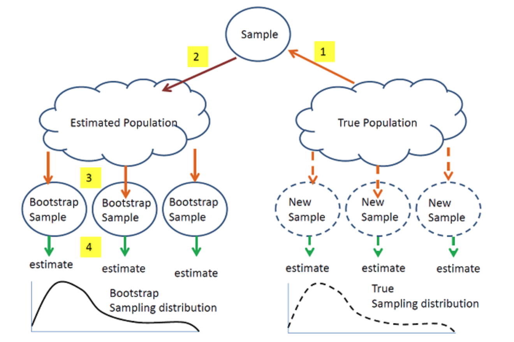

```{r setup, include=FALSE}
knitr::opts_chunk$set(echo = TRUE)
```

# Outline

In this module, we will continue our discussion on Bootstrap.


# What is bootstrap?

A widely applicable, computer intensive resampling method used to compute standard errors, confidence intervals, and significance tests.

# Why bootstrap?

- The exact sampling distribution of an estimator can be **difficult** to obtain
- Asymptotic expansions are sometimes easier but expressions for standard errors based on large sample theory may not perform well in finite samples

# 


https://online.stat.psu.edu/stat555/node/119/

# Example:  estimate the variance of an estimator

Now let $\operatorname{Var}_F\left(T_n\right)$ denote the variance of $T_n$. The subscript $F$ means the variance is a function of $F$ where $F$ is the CDF of $X$. If we know $F$, we can directly compute the variance. For example, if then $x_1, \cdots, x_w$ iid
$$
T_n=\bar{X}_n,=\frac{1}{n} \sum_{i=1}^n x_i
$$
$$
\operatorname{Var}_F\left(T_n\right)=n^{-1}\left(\int x^2 d F(x)-\left(\int x d F(x)\right)^2\right)
$$
which is a function of $F$.

# Example:  estimate the variance of an estimator

When $F$ is unknown, one can use an estimate of $F$, e.g., the empirical CDF $\hat{F}_n$, i.e.,
$$
\hat{F}_n(x)=\frac{\sum_{i=1}^n \mathbf{1}\left(X_i \leq x\right)}{n} .
$$
We then use a plug-in estimator for $\operatorname{Var}_{\hat{F}_n}\left(T_n\right)$ :
$$
\operatorname{Var}_{\hat{F}_n}\left(T_n\right)=n^{-1}\left(\int x^2 d \hat{F}_n(x)-\left(\int x d \hat{F}_n(x)\right)^2\right) .
$$

# Example:  estimate the variance of an estimator

However, the plug-in estimator above can be hard to compute, we can then approximate it with a simulation estimate, denoted by $V_{\text {boot }}$.

The following algorithm illustrate how one can do this through bootstrap.

\begin{tabular}{l}
\hline Algorithm 1: Bootstrap variance estimation algorithm \\
\hline Input data $\left(X_1, \ldots, X_n\right) ;$ Number of iteration $B ;$ \\
for $i \leftarrow 0$ to $B$ do \\
$\quad \begin{array}{l}\text { Draw } X_{1, i}^*, \ldots, X_{n, i}^* \sim \hat{F}_n ; \\
\text { Compute } T_{n, i}^*=g\left(X_{1, i}^*, \ldots, X_{n, i}^*\right) ;\end{array}$ \\
end \\
$V_{\text {boot }}=\frac{1}{B} \sum_{i=1}^B\left(T_{n, i}^*-\frac{1}{B} \sum_{j=1}^B T_{n, j}^*\right)^2$. \\
\hline \end{tabular}

By law of large numbers, we have $V_{\text {boot }} \stackrel{\text { a.s. }}{\longrightarrow} \operatorname{Var}_{\hat{F}_n}\left(T_n\right)$ 
as $B \rightarrow \infty$.


# The bootstrap principle

Suppose $X=\left\{X_{1}, \ldots, X_{n}\right\}$ is a sample used to estimate some parameter $\theta=T(P)$ of the underlying distribution $P$. To make inference on $\theta$, we are interested in the properties of our estimator $\hat{\theta}=S(X)$ for $\theta$.

\pause

- If we knew $P$, 
  - we could obtain $\left\{X^{b} \mid b=1, \ldots B\right\}$ from $P$ and use Monte-Carlo to estimate the sampling distribution of $\hat{\theta}$ 
  
\pause
  
- However, we don't, 
  - we do the next best thing and resample from original sample, i.e. the empirical distribution, $\hat{P}$
  - we expect the empirical distribution to estimate the underlying distribution well by the _Glivenko-Cantelli_ Theorem

# Why bootstrap works

Definition 2.1. Let $F, G$ be two CDF's on a sample space $X$. Let $\rho(F, G)$ be a metric on the space of CDF's on $X$. We say $G_n^*$ is weakly $\rho$-consistent if
$$
\rho\left(G_n^*, G_n\right) \stackrel{P}{\rightarrow} 0
$$
as $n \rightarrow \infty$. Similarly, $G_n^*$ is strongly $\rho$-consistent if
$$
\rho\left(G_n^*, G_n\right) \stackrel{\text { a.s. }}{\longrightarrow} 0 .
$$

# Why bootstrap works

Now the measure of closeness between two CDF's depends on the metric $\rho$. The following two metrics are commonly used for the CDF's:

(i) Kolmogorov metric:
$$
K(F, G)=\sup _{x \in R}|F(x)-G(x)| .
$$

(ii) Mallows-Wasserstein metric:
$$
l_2(F, G)=\inf _{T_{F, G}}\left(E|Y-X|^2\right)^{1 / 2},
$$
where $T_{F, G}$ is the collection of all possible joint distribution of the pair $(X, Y)$ whose marginal distributions are $F, G$.
The following theorem illustrates a special case of the bootstrap theory.

# Why bootstrap works

Theorem. Suppose $X_1, \ldots, X_n \stackrel{\text { i.i.d. }}{\sim} F$ and $E\left(X_i^2\right)<\infty$. Let
$$
T_n=g\left(X_1, \ldots, X_n\right)=\sqrt{n}(\bar{X}-\mu).
$$
For the bootstrap version $T_n^* = \sqrt{n}(\bar{X}_n^* - \bar{X}_n)$:
\[
K(G_n^*, G_n) \xrightarrow{a.s.} 0 \quad \text{and} \quad l_2(G_n^*, G_n) \xrightarrow{a.s.} 0
\]
where:
\begin{align*}
G_n(t) &= P(T_n \leq t) \quad \text{(True CDF)} \\
G_n^*(t) &= P(T_n^* \leq t \mid X_1, \dots, X_n) \quad \text{(Bootstrap CDF)}
\end{align*}

# Practical Implementation

\begin{block}{Monte Carlo Approximation}
For finite samples, estimate $G_n^*$ via:
\[
\hat{G}_n^*(t) = \frac{1}{B}\sum_{b=1}^B \mathbb{I}(T_{n,b}^* \leq t)
\]
where:
\begin{itemize}
\item $B$ = number of bootstrap samples
\item $T_{n,b}^* = \sqrt{n}(\bar{X}_{n,b}^* - \bar{X}_n)$
\end{itemize}
\end{block}

\begin{exampleblock}{Convergence}
\begin{center}
\begin{tabular}{cc}
$B \to \infty$ & $\hat{G}_n^* \to G_n^*$ \\
$n \to \infty$ & $G_n^* \to G_n$ \\
\end{tabular}
\end{center}
\end{exampleblock}


# Bootstrap confidence intervals

For a statistic $T_n$ with bootstrap replicates $\{T_{n,b}^*\}_{b=1}^B$:
\begin{itemize}
\item \textbf{Normal Approximation CI} (requires normality): \[
T_n \pm z_{\alpha/2}\widehat{se}_{boot}
\]
where $\widehat{se}_{boot}  = \sqrt{\frac{1}{B-1}\sum_{b=1}^B (T_{n,b}^* - \bar{T}^*)^2}$
\item \textbf{Pivotal (Basic) Bootstrap CI}:
\[
\Big(2T_n - T_{((1-\alpha/2)B)}^*, \ 2T_n - T_{((\alpha/2)B)}^*\Big)
\]

\item \textbf{Percentile Bootstrap CI}:
\[
\Big(T_{((\alpha/2)B)}^*, \ T_{((1-\alpha/2)B)}^*\Big)
\]
\end{itemize}

# Bootstrap confidence intervals
\begin{alertblock}{Important Notes}
\begin{itemize}
\item Normal CI assumes asymptotic normality of $T_n$
\item Pivotal CI inverts the bootstrap distribution
\item Percentile CI is simple but may be biased
\end{itemize}
\end{alertblock}

# Forms of bootstrap

Based on how the population is estimated, 

1. Nonparametric bootstrap
2. Parametric bootstrap
2. Empirical Bootstrap (Paired Bootstrap) 
3. Residual Bootstrap 
4. Wild Bootstrap

# Nonparametric bootstrap (resampling)

\begin{block}{Core Idea}
Resample \textit{with replacement} from original data to approximate sampling distribution of statistic $\hat{\theta} = S(\mathbf{D})$
\end{block}

\pause
\begin{enumerate}
\item \textbf{Resampling}: Generate $B$ bootstrap datasets \\
$\mathbf{D}^*(1), \ldots, \mathbf{D}^*(B)$ where each $\mathbf{D}^*(b)$ contains $n$ observations drawn \textit{with replacement} from original data $\mathbf{D} = (X_1,\ldots,X_n)$

\pause
\item \textbf{Replication}: Compute bootstrap statistics \\
$\hat{\theta}^*(b) = S(\mathbf{D}^*(b))$ for $b=1,\ldots,B$

\pause
\item \textbf{Standard Error Estimation}:
\[
\widehat{se}_{boot} = \sqrt{\frac{1}{B-1}\sum_{b=1}^B \left(\hat{\theta}^*(b) - \bar{\theta}^*\right)^2}
\]
where $\bar{\theta}^* = \frac{1}{B}\sum_{b=1}^B \hat{\theta}^*(b)$
\end{enumerate}


# Parametric bootstrap 

- Assumes the data comes from a known distribution with unknown parameters

- First estimate the parameters from the data and then use the estimated distribution to simulate the samples

# Bootstrap for Regression 

Bootstrap can also be used to conduct statistical inference for regression model. Let $\left(X_1, Y_1\right), \ldots,\left(X_n, Y_n\right)$ be the observed data and
$$
E\left(Y_i \mid X_i=x\right)=\beta_0+\beta_1 x,
$$
i.e.,
$$
Y_i=\beta_0+\beta_1 X_i+\epsilon_i .
$$
There are several variants to the bootstrap under regression setting.

# Empirical Bootstrap (Paired Bootstrap) 

We generate a new sets of i.i.d. observations $\left(X_1^*, Y_1^*\right), \ldots,\left(X_n^*, Y_n^*\right)$ such that for each $l$,
$$
P\left(X_l^*=X_i, Y_l^*=Y_i\right)=\frac{1}{n}
$$
for all $i$. Similar to bootstrap estimation of variance, we repeat this procedure $B$ times and fit a linear regression model for each of the generated paired data:
$$
\begin{gathered}
\left(X_1^{*(1)}, Y_1^{*(1)}\right), \ldots,\left(X_n^{*(1)}, Y_n^{*(1)}\right) \stackrel{\text { fit linear regression }}{\longrightarrow} \hat{\beta}_0^{*(1)}, \hat{\beta}_1^{*(1)} \\
\ldots \\
\left(X_1^{*(B)}, Y_1^{*(B)}\right), \ldots,\left(X_n^{*(B)}, Y_n^{*(B)}\right) \stackrel{\text { fit linear regression }}{\longrightarrow} \hat{\beta}_0^{*(B)}, \hat{\beta}_1^{*(B)} .
\end{gathered}
$$

# Empirical Bootstrap (Paired Bootstrap) 

We then estimate the bootstrap variance
$$
\hat{\operatorname{Var}}\left(\hat{\beta}_0\right)=\frac{1}{B} \sum_{l=1}^B\left(\hat{\beta}_0^{*(l)}-\bar{\beta}_0^*\right)^2, \bar{\beta}_0^*=\frac{1}{B} \sum_{i=1}^B \hat{\beta}_0^{*(l)},
$$
and
$$
\hat{\operatorname{Var}}\left(\hat{\beta}_1\right)=\frac{1}{B} \sum_{l=1}^B\left(\hat{\beta}_1^{*(l)}-\bar{\beta}_1^*\right)^2, \bar{\beta}_1^*=\frac{1}{B} \sum_{l=1}^B \hat{\beta}_1^{*(l)} .
$$
We can also obtain the bootstrap CI as
$$
\hat{\beta}_0 \pm z_{1-\alpha / 2} \sqrt{\hat{\operatorname{Var}}\left(\hat{\beta}_0\right)}
$$
and
$$
\hat{\beta}_1 \pm z_{1-\alpha / 2} \sqrt{\hat{\operatorname{Var}}\left(\hat{\beta}_1\right)}
$$

# Empirical Bootstrap (Paired Bootstrap) 

Although empirical bootstrap works well in practice, it may lead to a bad results, especially in the presence of influential observations (some $X_i$ 's are very far away from the others). 

This will also strongly affect the empirical bootstrap in the sense that if an empirical bootstrap does not select these influential points, the regression coefficients can be very different.

# Residual Bootstrap 

To solve the problem of empirical bootstrap illustrated previously, we may use the residual bootstrap. We first fit the original data to obtain the OLS estimate $\hat{\beta}_0, \hat{\beta}_1$. Define
$$
e_i=Y_i-\hat{Y}_i=Y_i-\hat{\beta}_0-\hat{\beta}_1 X_i .
$$
$e_i$ here are the fitted residuals and can be regarded as a good approximation of $\epsilon_i$.
The residual bootstrap generate i.i.d. $\hat{\epsilon}_1^*, \ldots, \hat{\epsilon}_n^*$ such that for each $\hat{\epsilon}_l^*$,
$$
P\left(\hat{\epsilon}_l^*=e_i\right)=\frac{1}{n} .
$$
Then we generate a new bootstrap sample
$$
\left(X_1^*, Y_1^*\right), \ldots,\left(X_n^*, Y_n^*\right)
$$
via
$$
X_i^*=X_i, Y_i^*=\hat{\beta}_0+\hat{\beta}_1 X_i+\hat{\epsilon}_i^* .
$$

# Wild Bootstrap

Another issue usually occur in linear regression is the so called phenomenon of heteroskedasticity, i.e., $\operatorname{Var}\left(\epsilon_i \mid X_i\right)$ depends on the value of $X_i$. 

Now residual bootstrap cannot deal with this issue. In particular, the residual bootstrap will be unstable because the residual bootstrap will swap all the residuals regardless of the value of the covariate. The solution to this is through the wild bootstrap.

The wild bootstrap first generate i.i.d. random variables $V_1, \ldots, V_n \sim \mathcal{N}(0,1)$ and then generate the bootstrap sample
$$
\left(X_1^*, Y_1^*\right), \ldots,\left(X_n^*, Y_n^*\right)
$$
by
$$
Y_i^*=\hat{\beta}_0+\hat{\beta}_1 X_i+V_i e_i, X_i^*=X_i .
$$

# Bootstrap hypothesis testing

\tiny
```{r, eval = F}
boot_dat <- function(x, n, mu, std) {
  newx <- sample(x, n, replace = T)
  return((mean(newx) - mu)/(std/sqrt(n)))
}


pvalues_1 <- rep(NA, nsim)
pvalues_2 <- rep(NA, nsim)

for (i in 1:nsim){
  x <- rnorm(n, mean = mu, sd = std)
  stat <- abs((mean(x) - mu)/(std/sqrt(n)))
  pvalues_1[i] <- 2*(1 - pnorm(stat))
  
  
  newx <- x - mean(x) + mu
  boot_scores <- sapply(1:nboot, 
                        function(index) boot_dat(newx, n, mu, std))
  boot_scores <- as.vector(boot_scores)
  # hist(boot_scores)
  # mean(boot_scores)
  pvalues_2[i] <- length(which(boot_scores > stat))/length(boot_scores) + 
    length(which(boot_scores < (-stat)))/length(boot_scores)
}
```

# Failures of Bootstrap 

Let $X_1, \ldots, X_n \stackrel{\text { i.i.d. }}{\sim}$ unif $(0,1)$ and $M_n=\min \left(X_1, \ldots, X_n\right)$ be the minimum of the sample. One can show that
$$
n M_n \stackrel{\mathcal{D}}{\rightarrow} \exp (1)
$$
However, let $M_n^*=\min \left(X_1^*, \ldots, X_n^*\right)$ be the minimum of a bootstrap sample, then
$$
P\left(\text { none of } X_1^*, \ldots, X_n^* \text { select } M_n\right)=\left(1-\frac{1}{n}\right)^n \approx e^{-1},
$$
which implies that
$$
P\left(M_n^*=M_n\right) \approx 1-e^{-1} .
$$
Therefore, $M_n^*$ has a huge probability mass at $M_n$. This means the distribution of $M_n^*$ is very different from the distribution of $M_n$. The detailed proof is left as homework.

# StatQuest videos 

Check out these videos made by Josh Starmer with vivid illustration for the boostrap! 

- Bootstrapping Main Ideas [[link](https://youtu.be/Xz0x-8-cgaQ)]

- Using Bootstrapping to Calculate p-values [[link](https://youtu.be/N4ZQQqyIf6k)]


# Resources

This tutorial is based on 

- PennState STAT555 Statistical Analysis of Genomics Data [[links](https://online.stat.psu.edu/stat555/node/119/)].

- Harvard's Biostatistics Preparatory Course Methods  [[links](https://isabelfulcher.github.io/methodsprep/slides/Lecture_7/2018_Lecture_07.pdf)].

