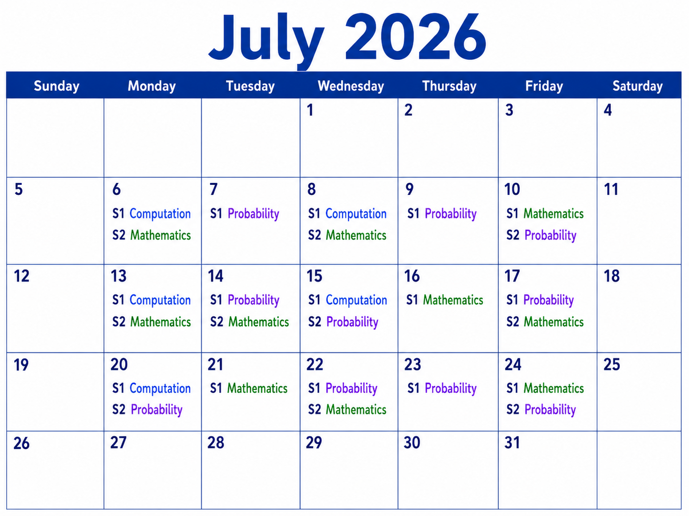

Below is the course schedule for 2025 Summer Bootcamp. 

Session 1 (S1) will run from 9:30 am--11:30 am and Session 2 (S2) will run from 11:30 am--13:30 pm (all times EDT/Toronto time).  

Zoom meeting information will be provided to all registered participants.



<!-- # ```{r, echo=FALSE} -->
<!-- # library(tidyverse) -->
<!-- # library(kableExtra) -->
<!-- # options(knitr.kable.NA = '') -->
<!-- # my_backgrounds <- colorRampPalette(c("white", "#002A5C"))(5) -->
<!-- # k <- 9 -->
<!-- # row_nums <-sort(c(seq(1,31,4), seq(2,31,4))) -->
<!-- # jsc270courseschedule <- read_csv("Schedule/schedule.csv") -->
<!-- # knitr::kable(jsc270courseschedule[1:31,]) %>%   -->
<!-- #   kable_styling(full_width = T, position = "float_left")   %>%    -->
<!-- #   row_spec(row_nums ,background = my_backgrounds[2])  -->
<!-- # ``` -->
